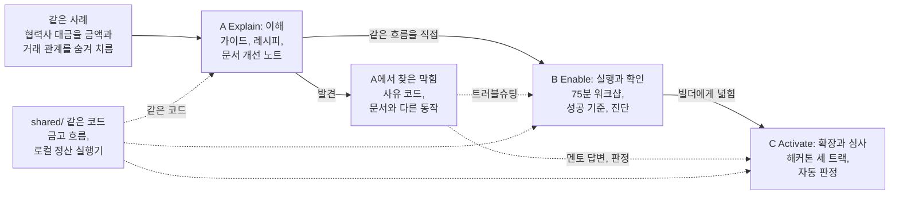

# Maroo 연동 실습: 비공개 공급업체 정산

Primary Track: A (Explain). 추가로 B(Enable)와 C(Activate)를 함께 제출합니다. English summary: [README.en.md](README.en.md)

구매 기업이 협력사 대금을 Maroo에서 치르면서 협력사별 금액과 거래 관계를 공개 체인에서 숨기는 정산 한 사례로 세 트랙을 만들었습니다. 한국 대기업집단이 2025년 하반기에 협력사에 치른 하도급대금은 89.1조원이고 그중 84.71%가 현금으로 나갔습니다([아시아경제 2026-07-14](https://view.asiae.co.kr/article/2026071410535320908)). 단가, 거래량, 거래처는 영업비밀로 보호받을 수 있는 정보라서, 이 대금을 공개 체인으로 옮기려면 금액과 거래 관계를 가리는 장치가 먼저 필요합니다.

## 한눈에 보기

| 트랙 | 독자 | 제출한 것 | 대표 명령 | 영상 |
| --- | --- | --- | --- | --- |
| A Explain (Primary) | 도입을 검토하는 기관 시니어 엔지니어 | [기관 연동 가이드](track-a-explain/integration-guide.md), [실행 레시피](track-a-explain/runnable-recipe.md), [기관 FAQ](track-a-explain/faq.md) 9개, [문서 개선 노트](track-a-explain/documentation-improvement-notes.md) 8개 | `pnpm a:kyb-gate`, `pnpm a:local` | 녹화 대기(2026-09-27) |
| B Enable | 워크샵에서 구현하는 기관 실무 엔지니어 | [75분 워크샵 패키지](track-b-enable/README.md)(참가자·진행자 가이드), [실행 데모](track-b-enable/demo/), [트러블슈팅](track-b-enable/troubleshooting.md) 10개 | `pnpm b:smoke` | 녹화 대기(2026-09-27) |
| C Activate | Maroo 해커톤에 참가할 빌더 | [세 트랙 포트폴리오](track-c-activate/portfolio.md), [Flagship 트랙 1](track-c-activate/tracks/1-private-settlement.md), [심사 자동 판정](track-c-activate/evidence.md#5-심사-자동-판정-예시-live-testnet-조회) | `pnpm c:agent-limit`, `pnpm c:judge` | 녹화 대기(2026-09-27) |

확인한 결과입니다. 탐색기 링크를 열면 tx의 성공·실패와 가스 사용량이 보입니다. 거부 사유는 탐색기가 풀지 못해 원문 선택자(`0xbca5593e…`)로만 나오므로 기록 파일의 `reason`에서 봅니다.

- `[Live Testnet]` KYB 증명이 없는 협력사의 청구는 PCL 정책이 `EasNoAttestationReceived`로 거부했고, 증명을 색인한 뒤의 청구는 통과했습니다([A 금고 흐름 기록](track-a-explain/evidence/live/pcl-kyb-gate-20260926T000141Z.json), 탐색기의 [거부 tx](https://explorer-testnet.maroo.io/tx/0xa4c7a3b9c025ce79c25f60d3f0b6e9e11deefb4e828d1e99bd163312c8cd557f)와 [통과 tx](https://explorer-testnet.maroo.io/tx/0x4d67c0dbf81db9c0f6e80bbe9c1d5676495800d0e7b4c643bed4df3a529cb81d)).
- `[Live Testnet]` Privacy 예치 요청은 전역 정책을 통과하고 요청 검증(`SDKInvalidRequest()`)에서 처음 막혔습니다. tx를 보내지 않고 `eth_call`과 `eth_estimateGas`로 확인했고, 유효한 증명을 만들 재료가 공개되지 않아 차폐 정산 전체는 Clairveil 로컬에서 돌렸습니다([A 진단 기록](track-a-explain/evidence/live/probe-first-failure-20260925T193314Z.json)).
- `[Local]` 협력사 B에게 보낸 15는 협력사 B, 구매 기업, 감사인이 각자 키로 풀었고, 제3자가 읽는 지급 tx에는 금액 필드가 없습니다([A 로컬 기록](track-a-explain/evidence/local/vendor-settlement-20260926T041658Z.md)).
- `[Live Testnet]` `[Local]` 워크샵 1~5단계와 단계별 성공 기준이 `pnpm b:smoke` 한 번에 91초 만에 통과했습니다([B 세션 기록](track-b-enable/evidence/session-20260926T000329Z.md)).
- `[Live Testnet]` 에이전트 한도 5 OKRW에서 3 OKRW 결제는 성공하고 8 OKRW 결제는 `ExceededAgentTransferLimit`로 거부됐습니다. 자동 판정이 이 기록으로 요건 R1~R4를 통과시켰습니다([C 판정 결과](track-c-activate/evidence/track2-example/evidence.judge.json), 탐색기의 [3 OKRW 결제](https://explorer-testnet.maroo.io/tx/0xfbfe489ff4545f5d701310ab3f3153cefc15efc22d91813fc69ab89042650787)와 [8 OKRW 거부](https://explorer-testnet.maroo.io/tx/0x006c9bae7cb92d04b2b9ba8f835ef81914ff81b91a5af2c51971b58a3c8856b9)).
- `[Live Testnet]` 문서와 다르게 동작한 곳 19건을 재현 명령, owner와 함께 [SUBMISSION_NOTES.md](SUBMISSION_NOTES.md#발견한-차이)에 적었습니다. PCL 정책에 거부된 tx는 문서와 달리 블록에 남아 가스 한도의 절반을 냈고([기록](track-a-explain/evidence/live/reject-gas-20260926T171442Z.json), 탐색기에 [150,000 / 300,000, 50%](https://explorer-testnet.maroo.io/tx/0xa4c7a3b9c025ce79c25f60d3f0b6e9e11deefb4e828d1e99bd163312c8cd557f)로 보임), 문서대로 에이전트 한도를 숫자 문자열로 쓰면 한도 안 결제까지 막혔습니다([기록](track-c-activate/evidence/live/agent-limit-20260926T044056Z.json)).

키와 잔액 없이 확인하려면 `pnpm install`, `pnpm bootstrap`(2분 안팎) 뒤 `pnpm review`(20초)를 돌립니다([실행](#실행)). 기준 버전은 Clairveil v0.4.0 [`ca85b02708fdd75259d4d2ee2d671c21198cec69`](https://github.com/DELIGHT-LABS/clairveil/tree/ca85b02708fdd75259d4d2ee2d671c21198cec69)이고, 13장 요약 장표는 [PDF](slides/maroo-integration-lab-summary.pdf)로 있습니다.

## 읽는 사람별 입구

| 읽는 사람 | 먼저 볼 곳 | 시간 | 읽고 나서 정할 수 있는 것 |
| --- | --- | --- | --- |
| 이 제출물을 처음 보는 리뷰어 | 위 한눈에 보기, [기관 연동 가이드](track-a-explain/integration-guide.md) 0절, [Track A 증거](track-a-explain/evidence.md) | 5분 | 어느 트랙부터 깊이 볼지 |
| 도입을 검토하는 기관 시니어 엔지니어(Track A 독자) | [기관 연동 가이드](track-a-explain/integration-guide.md) | 0절 5분, 전체 50분 | 4~8주 PoC에서 테스트넷으로 할 부분(OKRW, PCL, KYB 관문)과 로컬로 할 부분(차폐 정산), Maroo에 먼저 요청할 재료 |
| 기관의 사업·컴플라이언스 담당(개발자가 아닌 평가자 포함) | [요약 장표 13장](slides/maroo-integration-lab-summary.pdf), 같은 가이드 0절의 네 질문 표, [FAQ 9](track-a-explain/faq.md#9-지금-이-구조로-실제-협력사-대금을-처리할-수-있나요) | 10분 | 내부 보안·컴플라이언스 검토에 올릴 범위와 아직 체인에 없는 것(규제기관 열람, 테스트넷 Privacy 상태 변경) |
| 워크샵을 여는 DevRel·진행자(Track B) | [Track B README](track-b-enable/README.md), [진행자 가이드](track-b-enable/facilitator-guide.md) | 15분 | 75분 워크샵 일정과 사전 준비(바이너리 빌드 108초, 참가자당 OKRW 1,000과 이체 수수료 약 0.94 OKRW) |
| 해커톤을 설계하는 팀(Track C) | [트랙 포트폴리오](track-c-activate/portfolio.md), [트랙 2의 16절](track-c-activate/tracks/2-agent-payments.md#16-요건을-직접-채운-예시-live-testnet) | 15분 | 세 트랙 구성, 트랙별 최소 연동 요건, 심사 자동 판정(`pnpm c:judge`)을 행사에 쓸지 |
| AI 에이전트로 Maroo를 연동하는 개발자 | 에이전트 스킬([Claude Code용](.claude/skills/maroo-integration/SKILL.md), [Codex용](.agents/skills/maroo-integration/SKILL.md), 같은 파일), [AGENTS.md](AGENTS.md), [시험 기록](track-a-explain/evidence/code/skill-check-20260927.md)(두 도구 모두 새 클론에서 스스로 스킬을 열고 답함) | 5분 | 자기 에이전트나 사내 개발 도구에 이 규칙을 넣을지 |
| Maroo 문서·제품 팀 | [SUBMISSION_NOTES의 차이와 DX 피드백](SUBMISSION_NOTES.md#발견한-차이), [문서 개선 노트](track-a-explain/documentation-improvement-notes.md) | 30분 | 재현 명령과 owner가 붙은 문서 차이 19건, DX 피드백 14건의 처리 순서 |

제출물을 네 질문으로 보면 이렇습니다. 무엇을 확인했나: 위 결과 목록의 기록과 [증거 라벨](#증거-라벨). 무엇이 달랐나: [발견한 차이](SUBMISSION_NOTES.md#발견한-차이) 19건. 어디까지 검증했나: [직접 검증한 것과 문서로만 확인한 것](SUBMISSION_NOTES.md#직접-검증한-것과-문서로만-확인한-것). 다음에 무엇을 확인하나: [다음에 확인할 것](SUBMISSION_NOTES.md#다음에-확인할-것).

## 사례를 고른 이유

2026년에는 정산을 체인으로 옮기는 실증이 이어졌습니다. 카드업권 9개사의 스테이블코인 결제·정산 공동 PoC(7월, [벤처스퀘어](https://www.venturesquare.net/1100826)), 거래정보 보호 기술을 넣은 토스·한국조폐공사 지역화폐 정산 실증(9월, [파이낸셜뉴스](https://www.fnnews.com/news/202609180923593556)), 갤럭시아머니트리의 효성 사업장 간 정산 실증(9월, [뉴스핌](https://www.newspim.com/news/view/20260917000835))입니다. 하도급대금 자체를 다룬 파일럿은 조사에서 찾지 못했습니다.

## 세 트랙이 이어지는 방식

세 트랙은 같은 정산 사례를 이어받습니다. A가 구조와 경계를 설명하고, B에서 참가자가 같은 흐름을 직접 돌려 성공과 실패를 확인하고, C에서 빌더가 같은 primitive로 제품을 만들고 심사를 받습니다. 세 트랙이 같은 코드(`shared/`)를 부르므로, A의 레시피가 도는 한 B의 워크샵과 C의 첫 성공 경로도 같은 결과를 냅니다.



| 원문의 개발자 여정 | A | B | C |
| --- | --- | --- | --- |
| 이해 | [가이드](track-a-explain/integration-guide.md) 0~4절 | 참가자 가이드 첫머리와 흐름도 | [포트폴리오](track-c-activate/portfolio.md) 1~3절 |
| 실행 | [레시피](track-a-explain/runnable-recipe.md) | `pnpm b:step 1~5` | 트랙 1의 15분 첫 성공 경로, `pnpm c:agent-limit` |
| 확인 | [A 증거](track-a-explain/evidence.md) | 단계마다 성공 기준 | `evidence.json`과 `pnpm c:judge` |
| 진단 | 가이드 6절 최초 실패 계층 | 4단계 결과 분류, [트러블슈팅](track-b-enable/troubleshooting.md) | 트랙 1의 멘토 답변 방향 |
| 다음 단계 | 가이드 7절 PoC, 8절 남은 것 | "테스트넷 Privacy까지 남은 것" | 트랙별 제출 자료와 [다음에 확인할 것](SUBMISSION_NOTES.md#다음에-확인할-것) |

A에서 찾은 것이 B와 C로 넘어간 곳입니다.

| A에서 찾은 것 | B에서 | C에서 |
| --- | --- | --- |
| 증명은 색인한 뒤에야 PCL이 인식하고, 재발급 때는 폐기된 옛 증명이 보임(FAQ 5) | 2단계 6b 안내, 트러블슈팅 T8 | 트랙 1 멘토 답변, 트랙 3 주의 사항 |
| `eth_call`은 전역 정책을 평가하지 않음(문서 개선 노트 2) | 4단계 재시뮬레이션을 `eth_estimateGas`로 | 트랙 1 멘토 답변 |
| Privacy 예치가 요청 검증(`SDKInvalidRequest`)에서 처음 막힘(가이드 6절) | 4단계 "증명·입력 거부" 분류 | 트랙 1 R5 요건과 멘토 답변 |
| Clairveil v0.4.0 단독 인출 실패(문서 개선 노트 6) | 3단계 성공 기준, 트러블슈팅 T10 | 트랙 1 멘토 답변 |
| 단순 이체 가스가 문서 예시 21,000보다 큼(문서 개선 노트 7) | 진행자 가이드의 배분 수수료 | 트랙 1 주의 사항 |

## 실행

| 도구 | 확인한 판 |
| --- | --- |
| Node.js | 24.19 (24 이상 필요, TypeScript를 바로 실행. `.nvmrc`에 24) |
| pnpm | 11.25 |
| Go | 1.27.1 (Clairveil `go.mod`는 1.25.12 이상) |
| Foundry | 1.8.1 (solc 0.8.37 자동 설치) |
| Git | 2.43 |

아래 시간은 이 레포를 빈 폴더에 새로 받아 잔액 0인 새 지갑으로 잰 값입니다(Linux, WSL2).

### 1. 설치 (3초)

```bash
git clone https://github.com/kyle-park-io/maroo-integration-lab.git
cd maroo-integration-lab
pnpm install
```

성공하면 `Done in 2.6s using pnpm v11.25.0` 같은 줄이 나옵니다.

### 2. 준비 (2분 안팎, 한 번만)

```bash
pnpm bootstrap
```

Clairveil 고정 커밋 세 개를 `vendor/`에 받고, 금고를 컴파일하고, Clairveil 바이너리와 회로 산출물을 `.work/prebuilt/`에 빌드하고(101초), 역할 지갑 여섯 개를 레포 밖 파일에 만듭니다. 모두 109초 걸렸습니다. 성공하면 마지막 줄이 `준비를 마쳤습니다. 다음 명령은 pnpm review 입니다(키와 잔액 없이 실행됩니다).`입니다. 워크샵 참가자가 쓰는 `pnpm b:prepare`와 같은 코드입니다.

### 3. 한 번에 확인 (20초, 키와 잔액 없이)

```bash
pnpm review            # 타입 검사, 금고 테스트, 단위 테스트, 테스트넷 조회 넷, 워크샵 사전 점검
pnpm review --local    # 로컬 차폐 정산까지(1분 더)
```

성공하면 단계별 결과 표와 `8단계 가운데 8개 통과`가 나옵니다(`--local`이면 9단계). 테스트넷에는 조회만 하고 tx를 보내지 않습니다. 새 기록은 `.work/review/<시각>/`에 남고, 레포에 있는 증거 파일은 바뀌지 않습니다. 19초 걸렸고, `--local`은 이 머신에서 79초였습니다.

### 4. 테스트넷 OKRW 받기 (상태를 바꾸는 흐름에 필요)

2단계 출력 끝의 faucet 명령 두 줄로 구매 기업과 KYB 발급자가 5,000 tOKRW씩 받습니다. faucet이 실패하면 [레시피 2절](track-a-explain/runnable-recipe.md#2-지갑과-테스트넷-okrw)에 원인 확인 방법이 있고, 워크샵에서는 진행자가 `pnpm b:fund`로 나눠 줍니다. 받은 뒤 `pnpm b:check`에 `✓ 구매 기업 잔액 1,000 OKRW 이상(2단계)`이 나오면 됩니다.

### 5. 트랙별 실행

| 트랙 | 명령 | 걸린 시간 | 성공하면 보이는 줄 | 쓰는 테스트넷 OKRW |
| --- | --- | --- | --- | --- |
| A | `pnpm a:kyb-gate` | 37초 | `[예상대로 거부] 5) 협력사 B claim, 증명 없음 : EasNoAttestationReceived(…)`, `[성공] 6d) 협력사 A claim, 증명과 색인 뒤` | 구매 기업 250(가스 보충 120, 협력사 A가 받는 100 포함), 발급자 8 |
| A | `pnpm a:local` | 1분(2단계 뒤) | `기록: track-a-explain/evidence/local/vendor-settlement-<시각>.md` | 없음(로컬) |
| A | `pnpm a:probe-send-gas` | 10초 안팎 | `가스 한도 21000: reverted, 쓴 가스 21000` | 약 4(자기 협력사 지갑으로 옮기는 2 포함) |
| B | `pnpm b:smoke` | 91초 | `모두 통과. 91초` | 2단계가 약 260 |
| B | `pnpm b:step 1` ~ `pnpm b:step 5` | 워크샵 75분 | 단계마다 예상 결과와 성공 기준을 먼저 보이고, 실패하면 트러블슈팅 번호를 안내 | 2단계가 약 260 |
| C | `pnpm c:agent-limit` | 20초 안팎 | `[예상대로 거부] 4b) 에이전트 결제 8 OKRW(한도 초과) : ExceededAgentTransferLimit(…)` | 약 30(처음 한 번은 에이전트 지갑에 가스용 30을 더 보냄) |
| C | `pnpm c:judge <evidence.json> --track 2` | 5초 안 | `✓ R4 ExceededAgentTransferLimit 거부` | 없음(조회) |

- 역할 지갑 파일 형식은 [testnet.env.example](testnet.env.example)에 있습니다. 실제 키는 `~/.config/maroo-integration-lab/testnet.env`(권한 600)에만 두고 레포에 올리지 않습니다. 다른 위치를 쓰려면 `MAROO_LAB_ENV`를 지정합니다.
- 문서의 Mermaid 다이어그램은 `pnpm diagrams:check`로 밝은 테마와 어두운 테마에서 렌더링을 확인합니다.
- GitHub Actions([ci.yml](.github/workflows/ci.yml))가 푸시마다 타입 검사, 금고 서식과 테스트, 단위 테스트를 돌립니다. 테스트넷은 부르지 않습니다.
- AI 에이전트로 Maroo를 연동한다면: 이 레포를 Claude Code로 열면 [`.claude/skills/maroo-integration`](.claude/skills/maroo-integration/SKILL.md) 스킬이, Codex로 열면 같은 파일인 [`.agents/skills/maroo-integration`](.agents/skills/maroo-integration/SKILL.md) 스킬이 함께 읽힙니다. 이 레포가 테스트넷에서 확인한 규칙(사전 검사, 가스 한도, 프록시 배포, 증명 색인 순서, 에이전트 한도 형식)과 문서와 다른 곳, 확인 명령을 담았고, 표에 없는 ABI나 동작은 짐작하지 말고 명령으로 확인하게 했습니다. 스킬 폴더를 스스로 찾지 않는 도구는 루트 [AGENTS.md](AGENTS.md)가 이 스킬로 안내합니다. Codex에 같은 질문 여섯 개를 물었을 때, 스킬 자리와 AGENTS.md가 모두 없으면 스킬을 한 번도 읽지 않고 가스 질문에서 문서의 틀린 수치를 되풀이했습니다. `.agents/skills/`에 스킬을 두거나 AGENTS.md를 두면 여섯 번 모두 스킬을 열고 맞게 답했습니다([시험 기록](track-a-explain/evidence/code/skill-check-20260927.md#4차-시험-codex가-스스로-찾는-자리에-둔-스킬-2026-09-27-15시대-kst)). 두 스킬 파일이 다르거나 frontmatter(`name`, `description`)가 스킬 규약에 맞지 않으면 `pnpm test:unit`이 실패합니다.

## 증거 라벨

| 라벨 | 뜻 |
| --- | --- |
| `[Live Testnet]` | Maroo 테스트넷(chain ID 450815)에서 직접 실행하거나 조회한 결과. tx 해시, 탐색기 링크, 기록 파일이 있음 |
| 시뮬레이션 | 테스트넷 상태로 `eth_call`이나 `eth_estimateGas`만 부르고 tx는 보내지 않은 결과. `[Live Testnet]` 옆에 호출 방법을 함께 적었고, 유효한 증명이 없는 Privacy 호출은 거부 경로 증거로만 씀 |
| `[Local]` | Clairveil v0.4.0 로컬 체인에서 실행한 결과. Maroo 테스트넷 호환성의 증거가 아님 |
| `[코드 대조]` | 공개 코드와 패키지(ABI, fixture)를 스크립트로 직접 대조한 결과. 체인을 부르지 않음 |
| `[Docs Only]` | 문서로만 확인한 내용 |
| 권고 | 이 레포가 제안하는 설계와 절차. 실행으로 검증하지 않음 |

Maroo 테스트넷에서는 OKRW, PCL, EAS 경로를 실행하고 Privacy는 처음 막히는 층(요청 검증, `SDKInvalidRequest`)까지 진단합니다. 외부 개발자가 유효한 Privacy 증명을 만들 회로 산출물과 차폐 상태 조회 경로가 공개되지 않아, 차폐 흐름 전체는 Clairveil 로컬에서 실행합니다. 두 환경의 결과를 한 흐름의 성공으로 합치지 않습니다.

## 레포 구조

```text
AGENTS.md          코딩 에이전트가 먼저 읽는 안내(스킬로 연결)
.claude/skills/    에이전트 스킬 원본(Claude Code가 스스로 찾는 자리)
.agents/skills/    같은 스킬(Codex가 스스로 찾는 자리, 원본과 같은지 단위 테스트가 확인)
shared/            세 트랙이 함께 쓰는 코드
  contracts/       SettlementVault.sol (PCL 프록시 뒤에 두는 정산 금고)
  test/            금고 Foundry 테스트
  lib/             테스트넷 도구, KYB 금고 흐름, 로컬 차폐 정산 실행기, 정책 해석
track-a-explain/   가이드, 레시피, FAQ, 문서 개선 노트, recipe/*.ts, evidence/
track-b-enable/    참가자·진행자 가이드, 트러블슈팅, demo/*.ts, evidence/
track-c-activate/  포트폴리오, tracks/ 세 트랙, grounding/*.ts, evidence/
```

- 권장 구조와의 대응: `docs/`는 `track-a-explain/`, `demo/`와 `workshop/`은 `track-b-enable/`, `hackathon/`은 `track-c-activate/`, `video-link.md`는 [한눈에 보기](#한눈에-보기) 표의 영상 칸입니다. 세 트랙이 같은 코드(`shared/`)를 쓰므로 트랙별 폴더로 나눴습니다.
- Clairveil 조합: v0.4.0 [`ca85b02708fdd75259d4d2ee2d671c21198cec69`](https://github.com/DELIGHT-LABS/clairveil/tree/ca85b02708fdd75259d4d2ee2d671c21198cec69). clairveil-samples [`8321dedc231372679cfbea4314d080ecaea2e3f5`](https://github.com/DELIGHT-LABS/clairveil-samples/tree/8321dedc231372679cfbea4314d080ecaea2e3f5)가 맞춰 둔 조합이라 ClairveilJS [`faf220d5b2fa1a186c30893ca74d765474015aee`](https://github.com/DELIGHT-LABS/clairveiljs/tree/faf220d5b2fa1a186c30893ca74d765474015aee)와 함께 받고, 실행 경로는 Clairveil의 Go 바이너리만 씁니다.
- 제출 메모: [SUBMISSION_NOTES.md](SUBMISSION_NOTES.md)(가정과 차이, 검증, AI 사용, DX 피드백, 알려진 한계)

## 알려진 한계

- Maroo 테스트넷에서 유효한 Privacy 상태 변경은 실행하지 못했습니다. 필요한 재료가 공개되지 않았고, 비공개 구성 요소는 추측하지 않았습니다.
- 테스트넷 faucet이 전역 정책 한도에 걸려 있던 2026-09-25 16:41 UTC부터 09-26 00:00 UTC까지는 상태 변경 tx를 보내지 못했습니다. 한도가 풀린 뒤 KYB 금고 흐름(`a:kyb-gate`, `b:step 2`), 에이전트 등록(`c:grounding --write`), 에이전트 한도 실증(`c:agent-limit`)을 실행해 각 트랙 evidence.md에 넣었습니다.
- 코드는 PoC와 레퍼런스 수준입니다. 프로덕션 키 관리, 지갑, 프론트엔드는 범위 밖입니다.
- 자세한 목록은 [SUBMISSION_NOTES.md의 Known Limitations](SUBMISSION_NOTES.md#known-limitations)에 있습니다.

## 외부 코드와 라이선스

| 코드 | 쓰는 방식 | 라이선스 |
| --- | --- | --- |
| [Clairveil](https://github.com/DELIGHT-LABS/clairveil), [ClairveilJS](https://github.com/DELIGHT-LABS/clairveiljs), [clairveil-samples](https://github.com/DELIGHT-LABS/clairveil-samples) | `pnpm setup:clairveil`이 고정 커밋을 `vendor/`에 받습니다(레포에는 넣지 않음). 코드는 수정하지 않았습니다. Clairveil은 바이너리와 회로 산출물을 빌드해 로컬 체인과 CLI로 쓰고, 로컬 정산 실행기의 흐름은 `scripts/privacy-e2e-smoke.sh`를 따르되 역할과 금액만 바꿨습니다. ClairveilJS는 의존성을 설치해 자체 검사(`pnpm sdk:check`)를 돌리고, 정식 EVM 계약 fixture를 Maroo ABI 대조(`pnpm a:abi-compare`)에 씁니다. clairveil-samples는 조합을 맞추는 기준과 EVM 설정 예시로 씁니다 | Apache-2.0 |
| [@maroo-chain/contracts](https://www.npmjs.com/package/@maroo-chain/contracts) 0.0.9 | 프리컴파일 ABI | MIT |
| [@maroo-chain/viem](https://www.npmjs.com/package/@maroo-chain/viem) 0.4.0 | Maroo 공식 TypeScript SDK. PCL 정책 해석, 금고 프록시 배포와 정책 바인딩 | Apache-2.0 |
| [viem](https://viem.sh) 2.56.8 | 체인 호출 | MIT |
| [OpenZeppelin Contracts](https://github.com/OpenZeppelin/openzeppelin-contracts) 5.6.1 | 금고의 `Initializable` | MIT |
| [forge-std](https://github.com/foundry-rs/forge-std) 1.11.0 | 금고 테스트 | MIT 또는 Apache-2.0 |
| [mermaid-cli](https://github.com/mermaid-js/mermaid-cli) 11.17 | 다이어그램 렌더링 검사 | MIT |
| [yaml](https://github.com/eemeli/yaml) 2.9.1 | 에이전트 스킬 frontmatter 검사(단위 테스트) | ISC |

이 레포의 코드와 문서는 [MIT 라이선스](LICENSE)입니다. `vendor/`에 받는 외부 코드는 위 표의 원래 라이선스를 따릅니다.
