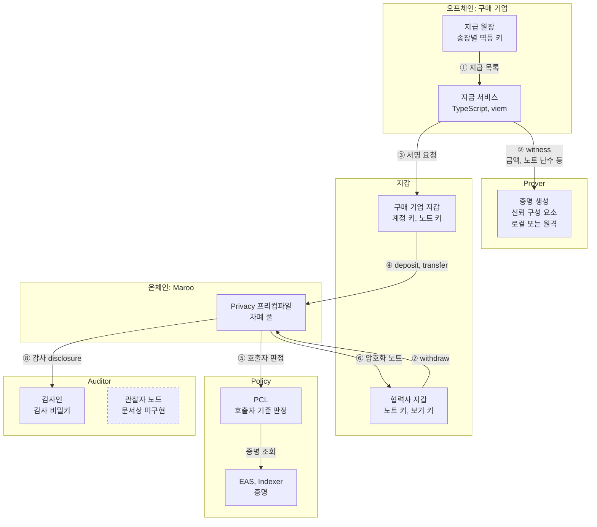
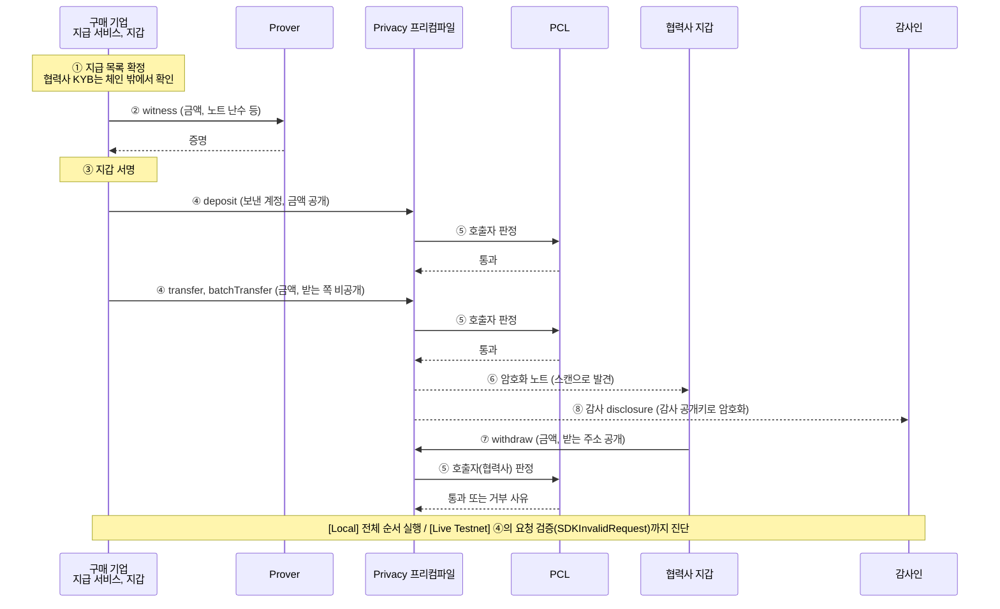
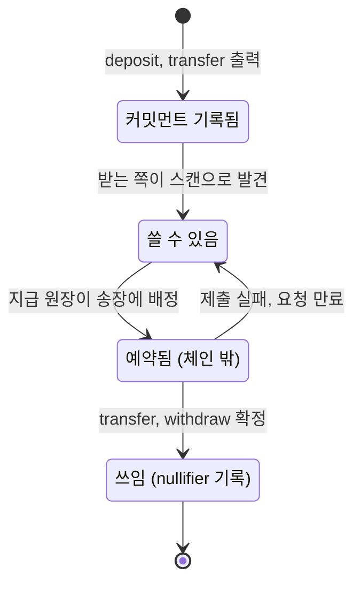

# 기관 연동 가이드: Maroo에서 협력사 대금을 비공개로 정산하기

- 기준: Maroo Docs(2026-09-25 확인), Maroo 테스트넷(chain ID 450815, 2026-09-26 확인), Clairveil v0.4.0 [`ca85b027`](https://github.com/DELIGHT-LABS/clairveil/tree/ca85b02708fdd75259d4d2ee2d671c21198cec69), `@maroo-chain/contracts` 0.0.9
- 표시: 문서에서 확인한 사실은 `[Docs Only]`, 직접 실행해 확인한 사실은 `[Live Testnet]`(Maroo 테스트넷)과 `[Local]`(Clairveil 로컬 체인)로 적습니다. 이 레포가 제안하는 설계와 절차는 "권고"로 따로 적습니다.
- 함께 보는 문서: [실행 레시피](runnable-recipe.md), [기관 FAQ](faq.md), [문서 개선 노트](documentation-improvement-notes.md)

## 0. 이 문서를 읽는 사람

이 가이드는 대기업 구매·재무 조직, 또는 그 지급 시스템을 운영하는 은행과 핀테크의 시니어 백엔드 엔지니어를 위해 썼습니다. 이 조직은 협력사 수백 곳에 매달 대금을 계좌이체나 상생결제로 치르고, 지급 기록은 ERP와 은행 전산에 남습니다. 원화 스테이블코인 정산을 검토하라는 요청을 받았고, 4~8주 PoC로 가능성을 확인한 뒤 보안, 컴플라이언스, 운영, 제품 팀에 결과를 설명해야 합니다. 개발 환경은 TypeScript 백엔드와 EVM 도구(viem, Foundry)입니다. 공개 체인에 대금을 올리면 협력사별 금액과 거래 관계가 누구에게나 보이는데, 단가와 거래량과 거래처 목록은 회사가 영업비밀로 관리하는 정보입니다([부정경쟁방지법 제2조](https://casenote.kr/법령/부정경쟁방지_및_영업비밀보호에_관한_법률/제2조)). PoC에서 판단할 것은 이 정보를 숨긴 채 감사인과 규제기관의 확인 요건을 맞출 수 있는지, 그리고 지금 Maroo에서 그 구조를 어디까지 직접 검증할 수 있는지입니다.

### 네 질문의 답

| 질문 | 답 | 자세히 |
| --- | --- | --- |
| OKRW, PCL, Privacy는 한 번의 지급에서 어떻게 이어지는가 | 구매 기업이 OKRW를 Privacy 프리컴파일에 예치하면 차폐 노트가 되고, 지급과 인출은 노트를 쓰고 새로 만듭니다. PCL은 이 호출마다 호출한 계정을 평가합니다. | 2절 |
| 누가 무엇을 볼 수 있는가 | 제3자는 예치 금액, 인출 금액과 받는 주소, 지급한 계정과 지급 건수를 봅니다. 지급 금액과 받는 협력사는 받는 협력사, 보낸 기업, 감사 키를 가진 쪽만 봅니다. | 3절 |
| 어떤 키와 서비스가 신뢰 경계에 드는가 | 지갑의 노트 키, 증명 요청을 받는 prover, 감사 비밀키, KYB 발급 키, PCL 정책 관리 권한, 컨트랙트 업그레이드 권한입니다. | 4절 |
| 레퍼런스와 프로덕션 사이에 무엇이 남는가 | 노트 하나에 약 18.45 OKRW인 금액 상한, 외부 감사를 받지 않은 참조 구현, 체인에 아직 없는 규제기관 열람 기능, 외부 개발자에게 공개되지 않은 증명 재료입니다. | 8절 |

### 지금 되는 것과 남은 것

| 범위 | 상태 | 라벨 | 근거 |
| --- | --- | --- | --- |
| Privacy 프리컴파일의 정책, 요구 증명, 요청 모양 조회 | 실행함 | `[Live Testnet]` | [조회 기록](evidence/live/inspect-privacy-boundary-20260925T192735Z.json) |
| Privacy 예치가 처음 막히는 층 진단 | 전역 정책은 통과하고 요청 검증(`SDKInvalidRequest`)에서 막힘 | `[Live Testnet]` eth_call과 eth_estimateGas, 거부 경로 증거 | [진단 기록](evidence/live/probe-first-failure-20260925T193314Z.json) |
| 보내기 전 정책 검사 방법 | `eth_call`은 전역 정책을 평가하지 않고 `eth_estimateGas`는 평가함 | `[Live Testnet]` | [검사 기록](evidence/live/probe-global-policy-20260925T190841Z.json) |
| OKRW 지급과 KYB 관문을 건 정산 금고 | 실행함. 증명 없음, 색인 전, 폐기 뒤 청구는 거부되고 색인 뒤 청구는 통과. 정책 관리자와 업그레이드 권한이 다른 주소 | `[Live Testnet]` 상태 변경 tx 18건 | [금고 흐름 기록](evidence/live/pcl-kyb-gate-20260926T000141Z.json) |
| 차폐 정산 전체(예치, 일괄 지급, 스캔, 해독, 인출) | 실행함 | `[Local]` Clairveil v0.4.0 | [로컬 실행 기록](evidence/local/vendor-settlement-20260925T181924Z.md) |
| 테스트넷에서 유효한 Privacy 상태 변경 | 외부에서 만들 수 없음. 회로 산출물과 상태 조회 경로가 공개되지 않음 | `[Live Testnet]`, `[Docs Only]` | 6절 |
| 규제기관의 관찰자 노드 열람 | 체인에 구현되지 않음 | `[Docs Only]` | [검증 가능한 프라이버시](https://docs.maroo.io/concepts/privacy/verifiable-privacy/) |

## 1. 한 장으로 보는 공급업체 정산

정산은 두 경로로 나눠 설계합니다. 금액과 받는 협력사를 숨기는 차폐 경로는 Privacy 프리컴파일을 씁니다. 받는 순간 협력사 자격을 체인이 직접 확인해야 하는 대금은 투명 경로로 보내고, PCL 정책을 건 정산 금고가 청구를 받습니다. 아래 그림은 차폐 경로의 구성 요소와 경계를 보여 주고, 투명 경로는 이 절 끝의 표에 있습니다.

### 여섯 경계

| 경계 | 구성 요소 | 하는 일 | 쥐고 있는 비밀 | 근거 |
| --- | --- | --- | --- | --- |
| 오프체인 | 지급 원장, 지급 서비스 | 송장을 지급 목록으로 묶고, 송장마다 멱등 키와 상태를 두고, 체인 결과와 대사합니다 | 송장 내용, 협력사 목록 | 권고 |
| 지갑 | 구매 기업 지갑, 협력사 지갑 | 요청에 서명하고, 체인의 암호화 노트를 스캔해 자기 노트를 찾고, disclosure를 풉니다 | 계정 키, 노트 키(지출, 보기) | `[Docs Only]` [Clairveil 위협 모델](https://github.com/DELIGHT-LABS/clairveil/blob/ca85b02708fdd75259d4d2ee2d671c21198cec69/docs/clairveil-threat-model.md), `[Local]` |
| Prover | 증명 생성 구성 요소 | witness(금액, 노트 난수, Merkle 경로, nullifier 등)를 받아 Groth16 증명을 만듭니다 | 요청마다 받는 witness | `[Docs Only]` [Clairveil 운영 가이드](https://github.com/DELIGHT-LABS/clairveil/blob/ca85b02708fdd75259d4d2ee2d671c21198cec69/docs/clairveil-operations-guide.md) |
| 온체인 | Privacy 프리컴파일 `0x…0b`, OKRW | 증명을 검증하고 커밋먼트와 nullifier를 기록하며, 예치된 OKRW를 보관합니다 | 없음. 커밋먼트, nullifier, 암호문만 기록합니다 | `[Docs Only]` [프라이버시 프리컴파일](https://docs.maroo.io/concepts/privacy/privacy-precompile-overview/) |
| Policy | PCL `0x…05`, EAS `0x…07`, Indexer `0x…08` | 상태를 바꾸는 호출마다 호출자를 전역 정책과 컨트랙트 정책으로 평가합니다 | 없음 | `[Docs Only]` [정책 인식 프리컴파일](https://docs.maroo.io/concepts/privacy/privacy-policy-aware-precompile/), `[Live Testnet]` 주소 |
| Auditor | 감사인, 관찰자 노드 | 모든 차폐 이동에 붙는 감사 disclosure를 풉니다. 관찰자 노드 열람은 체인에 아직 없습니다 | 감사 epoch 비밀키 | `[Local]`, `[Docs Only]` |

### Maroo가 외부 개발자에게 주는 인터페이스

| 인터페이스 | 위치 | 이 정산에서 쓰는 곳 | 라벨 |
| --- | --- | --- | --- |
| EVM JSON-RPC | `https://rpc-testnet.maroo.io`, chain ID 450815 | 모든 호출과 조회 | `[Live Testnet]` |
| OKRW 프리컴파일과 네이티브 잔액 | `0x1000…0001`, 테스트넷 denom `atokrw` | 대금, 가스, 금고 입금, Privacy 예치 금액 | `[Live Testnet]` |
| PCL 프리컴파일 | `0x1000…0005` | 전역 정책, Privacy 정책 조회, 금고 프록시 배포(`deployPclProxy`)와 정책 바인딩 | `[Live Testnet]` |
| EAS, SchemaRegistry, Indexer | `0x1000…0009`의 `getParams()`로 찾음 | KYB 스키마 등록, 증명 발급과 폐기, 색인 | `[Live Testnet]` |
| Privacy 프리컴파일 | `0x1000…000b` | 예치, 지급, 일괄 지급, 인출과 각각의 `*WithAuthorization` 변형. 조회 함수는 없습니다 | `[Docs Only]`, 호출은 `[Live Testnet]` eth_call |
| ABI 패키지 | `@maroo-chain/contracts` 0.0.9 | `IPcl`, `IPrivacy` ABI | `[Live Testnet]` 호출에 사용 |
| 탐색기 | `https://explorer-testnet.maroo.io` (Blockscout) | tx 확인, 이벤트 조회 | `[Live Testnet]` |

Maroo Docs에는 현재 테스트넷 verifier와 맞는 회로 버전과 proving 산출물, 차폐 상태(Merkle witness, nullifier 사용 여부, 암호화 노트 이벤트)를 읽는 조회 경로, 성공한 Privacy 호출의 예시 입력, prover 엔드포인트가 없습니다. `[Docs Only]` 그래서 외부에서 유효한 Privacy tx를 만들 수 없고, 6절의 진단도 그 지점에서 멈춥니다.

### Clairveil과 Maroo `x/privacy`의 관계

Clairveil은 Cosmos SDK 체인에 차폐 풀을 넣는 공개 참조 구현이고, Maroo 측 안내에 따르면 Maroo `x/privacy`의 기반으로 쓰입니다. 공개 자료만으로는 이 관계를 확인하기 어렵습니다. Maroo Docs에는 Clairveil이 나오지 않고, Clairveil 레포에도 Maroo가 나오지 않습니다. `[Docs Only]` 이 레포가 직접 대조한 연결 고리는 세 가지입니다.

1. Maroo `IPrivacy`의 전송 요청 필드 17개는 Clairveil v0.4.0 `MsgTransfer`의 18개에서 `creator` 하나를 뺀 것과 같습니다. EVM에서는 `msg.sender`가 `creator` 자리를 대신합니다. `[Live Testnet]` ABI 대조, [조회 기록](evidence/live/inspect-privacy-boundary-20260925T192735Z.json)
2. clairveil-samples의 EVM 설정 예시가 쓰는 Privacy 프리컴파일 주소 `0x1000…000b`가 Maroo 테스트넷 주소와 같습니다. `[Docs Only]` [`.env.evm.example`](https://github.com/DELIGHT-LABS/clairveil-samples/blob/8321dedc231372679cfbea4314d080ecaea2e3f5/.env.evm.example)
3. Clairveil v0.5.x의 전송 메시지(`privacy/v2`)는 출력마다 `outputs` 항목을 두고 감사 정보를 `audit` 하나로 묶는 모양으로 바뀌었습니다. Maroo 테스트넷 ABI는 v0.4.0 모양과 맞습니다. `[Docs Only]` [v0.5.1 `tx.proto`](https://github.com/DELIGHT-LABS/clairveil/blob/v0.5.1/proto/clairveil/privacy/v2/tx.proto), `[Live Testnet]` ABI 대조

모양이 같다는 사실이 회로와 검증 키가 같다는 증거는 되지 못합니다. 그래서 이 레포는 Clairveil을 구조와 흐름을 배우고 로컬에서 재현하는 자료로 쓰고, Maroo 테스트넷의 주소와 ABI와 호출 방식은 Maroo Docs를 기준으로 삼습니다.

### 투명 경로: KYB 관문을 건 정산 금고

| 단계 | 호출 | PCL 판정 | 공개 체인에 보이는 것 |
| --- | --- | --- | --- |
| 배포 | 구매 기업이 금고 구현을 배포하고 `deployPclProxy`로 Transparent 프록시를 만듭니다. `claim()` 선택자에만 KYB `EAS_POLICY`를 겁니다 | 전역 정책 | 배포자, 프록시, 정책 |
| 입금 | 구매 기업이 협력사별 몫을 `fund(supplier)`로 넣습니다 | 전역 정책. `fund`는 금고 정책 대상이 아닙니다 | 구매 기업, 협력사 주소, 금액 |
| 청구 | 협력사가 `claim()`을 부릅니다 | 전역 정책과 금고 정책. KYB 증명이 없거나, 색인되지 않았거나, 폐기됐으면 거부 | 협력사 주소, 금액 |
| 회수 | 청구되지 않은 몫을 구매 기업이 `recall(supplier)`로 돌려받습니다 | 전역 정책 | 구매 기업, 협력사 주소, 금액 |

투명 경로에서는 금액과 거래 관계가 공개되지만, 대금이 나가는 순간 체인이 협력사 자격을 확인합니다. 자격 확인을 체인 기록으로 남겨야 하는 대금이나, 차폐 경로를 쓰기 전의 PoC 첫 단계에 맞습니다. 2026-09-26 실행에서 증명이 없는 협력사 B의 청구는 `EasNoAttestationReceived`, 색인 전의 협력사 A 청구도 `EasNoAttestationReceived`, 폐기 뒤 청구는 `EasAttestationRevoked`로 거부됐고, 색인 뒤 청구는 통과해 협력사 A가 100 OKRW를 받았습니다. `[Live Testnet]` [금고 흐름 기록](evidence/live/pcl-kyb-gate-20260926T000141Z.json) 금고 코드는 [`shared/contracts/SettlementVault.sol`](../shared/contracts/SettlementVault.sol), 실행은 [레시피 4절](runnable-recipe.md#4-kyb-관문이-걸린-정산-금고-live-testnet)에 있습니다.

## 2. 한 번의 정산이 지나가는 길

| 단계 | 누가 | 하는 일 | OKRW | PCL | 차폐 풀 상태 |
| --- | --- | --- | --- | --- | --- |
| ① | 지급 원장 | 정산 주기의 송장을 확정하고 협력사 KYB를 체인 밖에서 확인합니다 | 없음 | 없음 | 없음 |
| ② | 지급 서비스, prover | 노트마다 witness를 만들어 증명을 받습니다 | 없음 | 없음 | 없음 |
| ③~④ 예치 | 구매 기업 지갑 | `deposit`에 OKRW를 실어 보냅니다 | 구매 기업 잔액에서 풀로 이동 | 구매 기업을 평가 | 커밋먼트 추가 |
| ④ 지급 | 구매 기업 지갑 | `transfer` 또는 `batchTransfer`(최대 20건, 원자적)로 협력사 노트를 만듭니다 | 풀 안에서만 이동 | 구매 기업을 평가 | 입력 노트의 nullifier 기록, 새 커밋먼트 추가 |
| ⑥ | 협력사 지갑 | 체인의 암호화 노트를 스캔해 자기 노트를 찾습니다 | 없음 | 없음 | 없음 |
| ⑦ | 협력사 지갑 | `withdraw`로 투명 OKRW를 받습니다 | 풀에서 협력사 주소로 이동 | 협력사를 평가 | nullifier 기록 |
| ⑧ | 감사인 | 지급마다 붙은 감사 disclosure를 감사 비밀키로 풉니다 | 없음 | 없음 | 없음 |

- Privacy 프리컴파일은 상태를 바꾸는 모든 호출에서 먼저 전역 정책을, 이어서 자기 주소에 묶인 컨트랙트 정책을 평가합니다. 어느 쪽이든 호출을 거부할 수 있습니다. `[Docs Only]` [정책 인식 프리컴파일](https://docs.maroo.io/concepts/privacy/privacy-policy-aware-precompile/)
- 테스트넷 Privacy 프리컴파일의 컨트랙트 정책은 `And(EAS_POLICY, DENYLIST_POLICY)`입니다. 호출자는 개인 본인 인증 증명(스키마 `bytes32 kakaoIdHash, uint8 version`)이 있고 차단 목록에 없어야 합니다. 이 정책은 관리자 `0x58eC…804F`만 바꿀 수 있어서, 도입 기관이 Privacy 호출에 자기 KYB 조건을 직접 걸 수는 없습니다. `[Live Testnet]` [조회 기록](evidence/live/inspect-privacy-boundary-20260925T192735Z.json)
- PCL은 호출한 계정을 평가합니다. 차폐 지급에서 받는 협력사는 증명 안에 숨어 있으므로 체인은 지급하는 순간 협력사 자격을 볼 수 없습니다. 협력사 자격은 ①의 체인 밖 확인과, 협력사가 직접 부르는 ⑦에서 확인됩니다. 투명 경로의 금고가 `claim()`에 정책을 거는 이유도 같습니다.
- 로컬 실행에서 전송 하나는 입력 노트 두 개를 씁니다. 노트 하나로 보낼 때는 금액 0인 노트를 짝으로 두어야 해서, 구매 기업은 0 노트 셋을 함께 예치했습니다. `[Local]` [로컬 실행 기록](evidence/local/vendor-settlement-20260925T181924Z.md) 1절

### 노트와 지급 원장의 상태

체인이 아는 노트 상태는 커밋먼트가 기록됐는지와 nullifier가 기록됐는지 두 가지입니다. 같은 노트를 두 송장에 배정하지 않으려면 지갑이나 지급 원장이 체인 밖에서 노트를 예약해야 합니다. Clairveil은 이 예약을 체인 밖 설계로 둡니다. `[Docs Only]` [노트 예약 설계](https://github.com/DELIGHT-LABS/clairveil/blob/ca85b02708fdd75259d4d2ee2d671c21198cec69/docs/clairveil-note-reservation-design.md)

지급 원장은 송장마다 아래 상태를 둡니다(권고).

| 원장 상태 | 들어가는 조건 | 체인에서 확인하는 것 |
| --- | --- | --- |
| 준비 | 송장 확정, 노트 예약 | 예약한 노트의 nullifier가 아직 없음 |
| 제출 | tx 해시를 받음 | tx가 블록에 들어갔는지 |
| 확정 | tx 성공 | 새 커밋먼트와 nullifier가 기록됨 |
| 실패 | tx 실패, 요청 만료 | 실패 사유. 노트 예약을 풀고 준비로 돌림 |
| 불명 | 응답 시간 초과 | 새로 보내기 전에 tx 해시로 결과부터 확인 |

## 3. 누가 무엇을 보나

로컬 실행에서 역할마다 자기 키로 풀어 본 결과와, 아무 키 없이 공개 체인에서 읽히는 값을 정리했습니다. `[Local]` [로컬 실행 기록](evidence/local/vendor-settlement-20260925T181924Z.md) 2절, 3절

| 보는 쪽 | 볼 수 있는 것 | 볼 수 없는 것 |
| --- | --- | --- |
| 제3자(탐색기, 다른 기관) | 예치한 계정과 금액, 지급 tx를 보낸 계정과 tx 안의 지급 건수, 인출한 계정과 금액과 받는 주소 | 지급 금액, 받는 협력사, 어느 노트가 쓰였는지 |
| 구매 기업 | 자기 노트, 자기 지급의 내용(self-view) | 협력사가 인출 전에 노트를 어떻게 쓰는지 |
| 협력사 B | 자기가 받은 노트, B에게 보낸 disclosure(금액, 보낸 쪽, 받는 쪽) | 다른 협력사에게 간 지급 |
| 감사인 | 모든 지급의 감사 disclosure. 로컬 실행에서 세 건 모두 `verified=true` | 감사 키가 없는 기간의 내용 |
| 원격 prover 운영자 | 증명 요청에 들어간 금액, 노트 난수, Merkle 경로, 받는 쪽 공개키 | 다른 prover에 맡긴 지급 |

- prover 행은 Clairveil 문서 기준입니다. `[Docs Only]` [운영 가이드](https://github.com/DELIGHT-LABS/clairveil/blob/ca85b02708fdd75259d4d2ee2d671c21198cec69/docs/clairveil-operations-guide.md), [위협 모델 72행](https://github.com/DELIGHT-LABS/clairveil/blob/ca85b02708fdd75259d4d2ee2d671c21198cec69/docs/clairveil-threat-model.md#L72) 이 레포의 로컬 실행은 CLI가 같은 프로세스 안에서 증명을 만들어 외부 prover를 거치지 않습니다. `[Local]`
- 예치 금액과 인출 금액이 모두 공개되어 금액으로 두 거래가 이어졌습니다. 구매 기업이 12를 예치하고 협력사 A가 12를 인출한 기록이 그대로 남았습니다. `[Local]`
- 일괄 지급 tx 안의 메시지 수가 송장 건수를 드러냅니다. `[Local]`
- 일괄 지급 tx는 CLI의 `--tx-hash` 해독이 첫 메시지만 풉니다. 감사인은 메시지마다 감사 암호문을 꺼내 따로 풀어야 모든 송장을 확인할 수 있습니다. `[Local]`
- 권고: 예치는 송장 단위 대신 정산 주기의 총액 단위로 하고, 협력사 인출은 여러 건을 모아 다른 시점에 합니다. 송장 건수까지 민감하면 정산 주기마다 일괄 지급 크기를 고정하는 방법을 PoC에서 시험합니다. 이 두 권고는 이 레포에서 검증하지 않았습니다.

## 4. 키와 서비스의 책임

| 키나 권한 | 권고하는 보관·운영 주체 | 잃으면 | 새면 | 근거 |
| --- | --- | --- | --- | --- |
| 구매 기업 계정 키 | 재무팀, HSM이나 멀티시그 | 예치와 지급을 할 수 없음 | 누군가 대금 재원을 옮김 | 권고 |
| 구매 기업 노트 키 | 지급 서비스, 계정 키와 분리 | 예치한 노트를 쓸 수 없음 | 지급 내역이 보임 | `[Docs Only]` Clairveil 위협 모델 |
| 협력사 노트 키와 보기 키 | 협력사 | 받은 대금을 쓸 수 없음 | 받은 내역이 보임 | Clairveil 레퍼런스는 지갑 파일을 평문 JSON(권한 0600)으로 두고, 프로덕션은 저장 시 암호화하라고 적습니다 `[Docs Only]` [위협 모델 96행](https://github.com/DELIGHT-LABS/clairveil/blob/ca85b02708fdd75259d4d2ee2d671c21198cec69/docs/clairveil-threat-model.md#L96) |
| prover | 기관 내부 서버나 지급 서비스와 같은 경계 | 증명을 만들 수 없어 지급이 멈춤 | 요청에 든 금액과 난수가 노출됨 | `[Docs Only]` 운영 가이드 |
| 감사 epoch 비밀키 | Maroo 문서에 없음. 내부 감사팀, 외부감사인, 규제기관 가운데 PoC에서 정함 | 해당 기간을 감사할 수 없음 | 해당 기간의 모든 감사 내용이 보임 | `[Docs Only]` [위협 모델 13행](https://github.com/DELIGHT-LABS/clairveil/blob/ca85b02708fdd75259d4d2ee2d671c21198cec69/docs/clairveil-threat-model.md#L13) |
| KYB 증명 발급 키 | 발급 기관 | 새 협력사에 증명을 줄 수 없음 | 자격 없는 협력사가 증명을 받음 | 권고 |
| 금고의 PCL 정책 관리 권한 | 구매 기업 컴플라이언스 담당 | 정책을 바꿀 수 없음 | 정책이 바뀌거나 떼어짐 | [금고 흐름 스크립트](recipe/pcl-kyb-gate.ts) |
| 금고 업그레이드 권한(ProxyAdmin 소유자) | 정책 관리와 다른 주체, 멀티시그와 타임록 | 버그를 고칠 수 없음 | 금고 로직이 바뀌어 협력사 몫이 빠져나감 | `[Docs Only]` [deployPclProxy](https://docs.maroo.io/apis/contract/contract-pcl-deploy-pcl-proxy/) |
| Privacy 프리컴파일 정책 관리 권한 | 체인 운영 측(`0x58eC…804F`) | 해당 없음 | 모든 Privacy 호출의 조건이 바뀜 | `[Live Testnet]` 조회 기록 |

- PCL 프록시는 Transparent, UUPS, Beacon 세 종류라 금고는 항상 업그레이드할 수 있습니다. 이 레포의 금고 흐름은 업그레이드 권한을 정책 관리와 다른 주소(`UPGRADE_OWNER`)에 두고, 배포 직후 ERC-1967 구현 슬롯과 관리자 슬롯을 직접 읽어 배포한 구현과 같은지 확인합니다. 다르면 흐름을 멈춥니다. 2026-09-26 실행에서 구현 슬롯은 배포한 구현과 같았고, 정책 관리자는 구매 기업, ProxyAdmin 소유자는 `UPGRADE_OWNER`였습니다. `[Live Testnet]` [금고 흐름 기록](evidence/live/pcl-kyb-gate-20260926T000141Z.json)
- 계정 키를 지급 서비스와 떼어 놓으려면 `*WithAuthorization` 변형을 씁니다. 계정 키 보유자(effective sender)가 EIP-712로 서명하고 지급 서비스가 대신 제출하며, PCL은 effective sender를 평가합니다. 서명에는 EVM chain ID와 Cosmos chain ID 해시가 함께 묶여, 다른 네트워크에서 재사용할 수 없습니다. `[Docs Only]` [EIP-712 도메인](https://docs.maroo.io/concepts/privacy/privacy-authorization-eip712-domain/)
- Maroo Docs는 Privacy 노트 키와 보기 키를 지갑이 어떻게 보관하는지 다루지 않습니다. `[Docs Only]`

## 5. 직접 실행하기

명령, 입력값, 예상 출력, 오류 처리는 [실행 레시피](runnable-recipe.md)에 있습니다. 가이드의 각 주장과 명령을 이렇게 이어 볼 수 있습니다.

| 확인하려는 것 | 명령 | 라벨 | 걸리는 시간 |
| --- | --- | --- | --- |
| Privacy 정책, 요구 증명, 요청 모양(1절, 2절) | `pnpm a:inspect` | `[Live Testnet]` 조회와 eth_call | 수 초 |
| Privacy가 처음 막히는 층(6절) | `pnpm a:probe` | `[Live Testnet]` eth_call, 거부 경로 증거 | 수 초 |
| 보내기 전 정책 검사(6절) | `pnpm a:probe-global` | `[Live Testnet]` 조회 | 수 초 |
| KYB 관문 금고(1절 투명 경로, 4절 권한 분리) | `pnpm a:kyb-gate` | `[Live Testnet]` 상태 변경 tx | 수 분, 테스트넷 OKRW 필요 |
| 차폐 정산 전체와 가시성(2절, 3절) | `pnpm setup:clairveil`, `pnpm a:local` | `[Local]` | 이 머신에서 약 4분, 실행 폴더 약 560MB |

로컬 실행의 가스 사용량은 예치 한 건 약 128만, 단건 지급 약 167만, 두 건 일괄 지급 약 319만, 인출 약 109만이었습니다. `[Local]` Maroo 테스트넷의 Privacy 가스는 유효한 tx를 만들 수 없어 측정하지 못했습니다.

## 6. 판정과 실패 진단

### 결과 분류

| 분류 | 알아보는 방법 | 다시 보내도 되나 | 할 일 |
| --- | --- | --- | --- |
| 성공 | receipt `status=success` | 해당 없음 | 원장을 확정으로 바꿈 |
| 정책 거부 | PCL ReasonCode(`EasNoAttestationReceived`, `EasAttestationRevoked`, `AnyOfRejected(...)` 등) | 조건을 바꾼 뒤 | 자식 사유까지 풀어 보여 주고, 증명 발급이나 한도 창을 기다림 |
| 요청 거부 | `SDKInvalidRequest`, `PrivacyRequestExpired`, `PrivacyNativeDenomMismatch` 등 | 요청을 새로 만든 뒤 | 증명과 요청 재료, 만료 시각, 금액 단위를 확인 |
| 노트 충돌 | `PrivacyDuplicateNullifier`, `PrivacyNullifierAlreadySpent` | 노트를 새로 스캔한 뒤 | 풀 상태를 오래된 것으로 본 경우가 많음 `[Docs Only]` |
| 한도 | `PrivacyTxLimitExceeded`, `PrivacySenderTxLimitExceeded`, `PrivacyBatchSizeOutOfRange` | 나눠서 | 한 tx의 호출 수와 일괄 지급 크기(최대 20)를 줄임 `[Docs Only]` |
| 결과 불명 | 응답 시간 초과, receipt 없음 | 기존 tx 해시를 확인한 뒤 | 같은 노트로 새 tx를 만들기 전에 대사 |

- 보내기 전 검사는 `eth_estimateGas`로 합니다. 같은 OKRW 전송을 불렀을 때 `eth_call`은 통과했고 `eth_estimateGas`는 `AnyOfRejected(ExceededPeriodicVolume(...), EasNoAttestationReceived(...))`로 거부했습니다. 전역 정책이 `eth_call`에서 평가되지 않기 때문입니다. `[Live Testnet]` [검사 기록](evidence/live/probe-global-policy-20260925T190841Z.json)
- Clairveil v0.4.0 로컬 체인에서는 인출을 단독으로 보낸 tx가 `merkle root snapshot re-registration is inconsistent`로 실패했고, 같은 블록에 잎을 더하는 tx(0 노트 예치)를 함께 넣으면 성공했습니다. 다시 보내기만 하면 같은 오류가 납니다. Maroo 테스트넷에서도 같은 조건이 생기는지는 확인하지 못했습니다. `[Local]` [로컬 실행 기록](evidence/local/vendor-settlement-20260925T181924Z.md) 4절

### 테스트넷 Privacy의 최초 실패 계층

유효한 증명 없이 구매 기업 주소로 예치 요청을 `eth_call`과 `eth_estimateGas`로 불러 어느 층에서 처음 막히는지 봤습니다. 거부 경로 증거이고, Privacy 연동이 성공했다는 뜻은 없습니다. `[Live Testnet]` [진단 기록](evidence/live/probe-first-failure-20260925T193314Z.json)

| 층 | 확인 방법 | 테스트넷 결과 | 다음 층으로 가는 데 필요한 것 |
| --- | --- | --- | --- |
| 1. 네트워크와 주소 | chain ID, Privacy 주소의 정책 조회 | 통과 | 없음 |
| 2. 전역 정책 | `eth_estimateGas` | 통과. `eth_estimateGas`도 3층의 오류를 돌려줌 | 보내는 계정이 24시간 한도 안이거나 KYC 증명을 가짐 |
| 3. 요청 검증 | 빈 요청, 모양을 갖춘 요청 | `SDKInvalidRequest()` | 현재 verifier와 맞는 회로 산출물로 만든 증명, 커밋먼트, 암호화 노트 |
| 4. Privacy 컨트랙트 정책 | 본인 인증 증명(attestation)이 없는 지갑과 있는 지갑으로 같은 요청 | 두 지갑 모두 3층에서 먼저 막혀 도달하지 못함 | 개인 본인 인증 증명(`kakaoIdHash` 스키마) |
| 5. 증명 검증과 차폐 상태 | 유효한 요청 | 시험할 수 없음 | Merkle witness와 nullifier를 읽는 조회 경로, 성공한 예시 입력 |

- 카카오 본인 인증을 마쳐 Privacy 정책의 증명을 가진 지갑도, 증명이 없는 지갑과 똑같이 `SDKInvalidRequest()`에서 막혔습니다. 외부 개발자를 막는 것은 본인 인증보다 앞에 있는 증명 재료입니다. 요청 검증이 컨트랙트 정책 평가보다 앞서는지, 시뮬레이션에서 컨트랙트 정책이 평가되지 않는지는 이 진단으로 가릴 수 없습니다. `[Live Testnet]` [인증 지갑 진단 기록](evidence/live/probe-kyc-holder-20260925T201710Z.json)
- 권고: 3층과 5층을 넘으려면 Maroo에서 네 가지를 받아야 합니다. 현재 테스트넷 verifier와 맞는 회로 버전 고정값, 그 회로의 proving 산출물, 차폐 상태 조회 경로(엔드포인트와 proto 또는 예시), 성공한 예치와 지급의 예시 입력입니다. 받기 전까지 차폐 흐름은 Clairveil 로컬에서 검증하고, 두 환경의 결과를 한 흐름으로 합쳐 표현하지 않습니다.

## 7. 4~8주 PoC 설계 (권고)

| 주차 | 목표 | 산출물 | 끝났다고 보는 기준 | 함께 보는 팀 |
| --- | --- | --- | --- | --- |
| 1 | 이 레포를 기관 환경에서 재현 | 실행 로그, 망 접근 확인 결과 | 사내 망에서 테스트넷 RPC와 탐색기에 닿고, 레시피 3절과 5절이 같은 결과를 냄 | 보안, 인프라 |
| 2~3 | 투명 경로와 KYB 관문 | 기관 KYB 스키마, 발급자 역할, 금고 흐름 기록 | 증명 없음, 색인 전, 폐기 후 청구가 모두 거부되고 정상 청구가 통과함. 권한 분리가 슬롯 조회로 확인됨 | 컴플라이언스 |
| 3~5 | 차폐 경로를 로컬에서 정산 주기 한 번 재현 | 지급 원장 연동 코드, 대사 스크립트 | 송장 N건이 한 번씩만 지급되고, 재시도와 시간 초과 시험에서 이중 지급이 없고, 감사인이 모든 송장을 해독함 | 운영, 내부 감사 |
| 5~6 | 테스트넷 Privacy 재진단 | 최초 실패 계층 기록 갱신 | Maroo에서 받은 재료로 정상 경로를 실행하거나, 받지 못했으면 막힌 층과 누락 재료를 문서로 남김 | 제품 |
| 7~8 | 검토 자료와 도입 판단 | 키 보관 설계, prover 배치안, 감사 키 운영안, 금액 상한 영향 분석 | 보안, 컴플라이언스, 운영, 제품 팀이 각자 남은 위험 목록에 서명 | 전체 |

PoC를 시작하기 전에 Maroo에 확인할 항목은 6절의 증명 재료 네 가지, 기관 KYB로 Privacy 호출을 제한하는 경로, 감사 키 보관 모델, 금액 상한과 관찰자 노드의 일정입니다.

## 8. 프로덕션 전에 남은 것

| 항목 | 현재 | 영향 | 풀어야 하는 쪽 | 근거 |
| --- | --- | --- | --- | --- |
| 차폐 금액 상한 | 노트 하나에 2^64-1 기본 단위, 약 18.45 OKRW | 1,000만 원을 차폐하려면 노트 542,102개와 일괄 지급 27,106번(20건씩)이 필요 | Maroo | `[Docs Only]` [IPrivacy.deposit](https://docs.maroo.io/apis/contract/contract-privacy-deposit/), 계산 |
| 참조 구현의 성숙도 | Clairveil은 `PUBLICATION_READY_EXPERIMENTAL`. 공식 trusted setup, 외부 ZK·보안 감사, 서명된 산출물 배포, 감사 키 보관을 범위 밖으로 둠 | 기관 보안 심의를 통과할 근거가 없음 | Maroo | `[Docs Only]` [CHANGELOG v0.4.0](https://github.com/DELIGHT-LABS/clairveil/blob/ca85b02708fdd75259d4d2ee2d671c21198cec69/CHANGELOG.md) |
| 출시 전 관문 | 운영 가이드의 최소 메인넷 관문 10개, 위협 모델의 다운스트림 보안 관문 9개 | 도입 기관이 확인할 목록이 이미 있음 | Maroo, 기관 | `[Docs Only]` [운영 가이드 11절](https://github.com/DELIGHT-LABS/clairveil/blob/ca85b02708fdd75259d4d2ee2d671c21198cec69/docs/clairveil-operations-guide.md), [위협 모델 8절](https://github.com/DELIGHT-LABS/clairveil/blob/ca85b02708fdd75259d4d2ee2d671c21198cec69/docs/clairveil-threat-model.md) |
| 규제기관 열람 | 관찰자 노드 disclosure 프로토콜이 체인에 없음. 지금 동작하는 규제 통제는 PCL 정책 평가 | 규제기관에 차폐 거래를 보여 줄 공식 경로가 없음 | Maroo | `[Docs Only]` [검증 가능한 프라이버시](https://docs.maroo.io/concepts/privacy/verifiable-privacy/) |
| 외부 개발자용 증명 재료 | 회로 산출물, 상태 조회 경로, 예시 입력이 공개되지 않음 | 기관이 테스트넷에서 차폐 흐름을 직접 검증할 수 없음 | Maroo | `[Live Testnet]` 6절 |
| 기관 KYB | 테스트넷 Privacy 정책은 개인 본인 인증 스키마만 요구하고, 기관용 스키마와 발급자는 없음 | 법인 계정이 Privacy를 부를 자격 경로가 없음 | Maroo, 발급 기관 | `[Live Testnet]` 조회 기록 |
| 회로 교체 | Clairveil v0.5.0은 호환되지 않는 genesis에서 올라오는 체인을 새 genesis로 초기화하고 노트와 스캔 결과를 버리라고 적음. 제자리 이전 경로 없음 | 회로가 바뀌면 차폐 잔액을 옮기는 계획이 필요 | Maroo, 기관 | `[Docs Only]` [CHANGELOG v0.5.0](https://github.com/DELIGHT-LABS/clairveil/blob/v0.5.1/CHANGELOG.md) |
| SDK 변화 | `@maroo-chain/viem` 0.4.0(2026-09-17)이 PCL 정책 템플릿 작성 함수 두 개를 지움 | 버전을 고정하지 않으면 빌드가 깨짐 | 기관 | npm 패키지 두 판 비교 |
| 기관 쪽 운영 | 키 보관(HSM, 멀티시그), 지급 원장과 대사, 망 분리 환경의 RPC 접근, 사고 대응 | PoC에서 설계하고 프로덕션에서 구축 | 기관 | 권고 |

## 부록 A. 용어

| 용어 | 뜻 |
| --- | --- |
| 차폐 풀 | Privacy 프리컴파일이 보관하는 OKRW와 노트 기록. 안의 이동은 금액과 받는 쪽이 드러나지 않음 |
| 노트 | 차폐 풀 안의 금액 한 덩어리. 받는 쪽 공개키와 금액과 난수로 만든 커밋먼트로 기록됨 |
| 커밋먼트 | 노트 내용을 숨긴 채 체인에 남기는 값. Merkle 트리의 잎이 됨 |
| 증명(proof) | 노트를 올바르게 쓰고 만들었다는 Groth16 영지식 증명. prover가 만듦 |
| 증명(attestation) | EAS에 기록된 자격 확인. 본인 인증, KYB 등. PCL 정책이 조회함 |
| nullifier | 노트를 썼다는 표시. 같은 nullifier가 다시 오면 체인이 거부함 |
| witness | 증명을 만드는 데 쓰는 비공개 입력(금액, 난수, Merkle 경로 등) |
| disclosure | 지급 내용을 특정 키로 암호화해 붙인 것. 받는 쪽용, 보낸 쪽 self-view용, 감사용이 있음 |
| 감사 epoch | 감사 공개키가 유효한 기간. 기간마다 감사 비밀키가 다름 |
| PCL | Maroo의 정책 계층. 전역 정책과 컨트랙트 정책으로 호출자를 평가함 |
| EAS | 증명(attestation)을 발급하고 조회하는 컨트랙트. PCL은 Indexer에 색인된 증명만 인식함 |
| KYB | 기업 고객 확인. 이 가이드에서는 협력사 자격 증명 |

## 부록 B. 증거 목록

| 파일 | 라벨 | 내용 |
| --- | --- | --- |
| [inspect-privacy-boundary-20260925T192735Z.json](evidence/live/inspect-privacy-boundary-20260925T192735Z.json) | `[Live Testnet]` | Privacy 정책 결합 방식, 요구 스키마, 예치 eth_call 결과, 요청 필드 대조 |
| [probe-first-failure-20260925T193314Z.json](evidence/live/probe-first-failure-20260925T193314Z.json) | `[Live Testnet]` | 요청 모양별 최초 실패 계층(eth_call, eth_estimateGas) |
| [probe-global-policy-20260925T190841Z.json](evidence/live/probe-global-policy-20260925T190841Z.json) | `[Live Testnet]` | `eth_call`과 `eth_estimateGas`의 전역 정책 평가 차이 |
| [doc-claims-20260925T191304Z.json](evidence/live/doc-claims-20260925T191304Z.json) | `[Live Testnet]` | 문서 문장과 체인 동작 대조 |
| [vendor-settlement-20260925T181924Z.md](evidence/local/vendor-settlement-20260925T181924Z.md) | `[Local]` | 차폐 정산 단계별 tx, 역할별 해독 결과, 공개 필드 |

## 부록 C. 기준 버전

| 대상 | 버전 |
| --- | --- |
| Maroo 테스트넷 | chain ID 450815, RPC `https://rpc-testnet.maroo.io` |
| Maroo Docs | `https://docs.maroo.io`, 2026-09-25 확인 |
| `@maroo-chain/contracts` | 0.0.9 |
| Clairveil | v0.4.0 `ca85b02708fdd75259d4d2ee2d671c21198cec69` |
| ClairveilJS | `faf220d5` |
| clairveil-samples | `8321ded` |
| viem | 2.56.8 |
| Foundry | 1.8.1, solc 0.8.37, EVM cancun |
