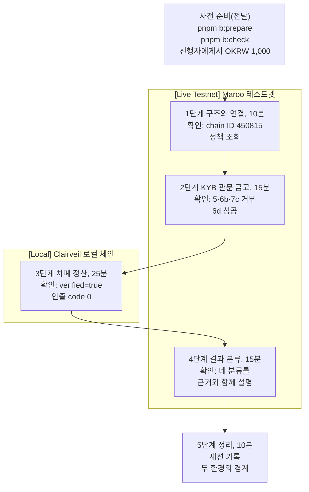

# 참가자 가이드: 협력사 대금을 Maroo에서 정산해 보기

75분 동안 구매 기업이 협력사에 대금을 치르는 흐름을 두 환경에서 직접 실행합니다. Maroo 테스트넷에서는 OKRW 이체와 PCL 정책이 걸린 정산 금고를 실제 트랜잭션으로 돌리고, 금액과 받는 쪽을 숨기는 차폐 정산은 Clairveil 로컬 체인에서 끝까지 돌립니다. 마지막에는 Maroo 테스트넷 Privacy가 어디서 멈추는지 진단하고, 두 환경의 결과를 구분해 설명합니다.

이 워크샵이 가정한 참가자는 은행, 결제사, 기업 재무 조직에서 원화 스테이블코인 정산 PoC를 맡게 될 실무 엔지니어입니다. TypeScript 백엔드를 만들어 봤고 블록체인 지갑과 트랜잭션을 한 번 이상 다뤄 봤습니다. 워크샵을 마치면 팀에 돌아가 무엇을 Maroo 테스트넷에서 직접 검증하고 무엇을 로컬 참조 구현으로 대신할지 제안해야 합니다. 개발 환경은 개인 노트북에서 공용 테스트넷 RPC에 닿는 네트워크로 가정했고, 사내 망 분리 환경은 다루지 않습니다. 확인한 운영체제는 Linux(WSL2)입니다.



## 마치면 할 수 있는 것

1. Maroo 테스트넷에 연결하고, 내 지갑의 잔액과 Privacy·전역 정책 상태를 확인합니다.
2. OKRW, PCL, EAS로 이어진 테스트넷 흐름을 실행하고, 결과가 통과인지 정책 거부인지 판정합니다.
3. Clairveil 로컬 체인에서 예치, 지급, 스캔, 해독, 인출을 끝까지 실행합니다.
4. 성공, 정책 거부, 증명·입력 거부, 인프라·자료 부재를 결과 화면에서 구분합니다.
5. 누가 어떤 disclosure를 풀 수 있는지, PCL이 누구를 평가하는지, 어떤 키가 신뢰 경계에 드는지 설명합니다.
6. Maroo 테스트넷에서 유효한 Privacy 실행으로 가려면 무엇이 더 필요한지와, 프로덕션 연동에서 풀어야 할 일을 나눠 말합니다.

## 사전 준비(워크샵 전날, 20분 안팎)

| 필요한 것 | 확인 방법 |
| --- | --- |
| Node.js 24 이상, pnpm 11 | `node --version`, `pnpm --version` |
| Go 1.25 이상 | `go version` |
| Git, Foundry(forge) | `git --version`, `forge --version` |
| 디스크 여유 1GB, 비어 있는 127.0.0.1:26657 | `pnpm b:check`가 확인합니다 |

```bash
git clone https://github.com/kyle-park-io/maroo-integration-lab.git
cd maroo-integration-lab
pnpm install
pnpm b:prepare     # Clairveil 받기, 금고 컴파일, 바이너리와 회로 산출물 빌드, 역할 지갑 만들기
pnpm b:check
```

- `pnpm b:prepare`가 끝나면 화면에 `BUYER` 주소가 나옵니다. 이 주소를 진행자에게 보내면 테스트넷 OKRW 1,000을 받습니다.
- 성공 기준: `pnpm b:check` 마지막 줄이 "필수 항목이 모두 준비됐습니다"이고, 받은 뒤에는 구매 기업 잔액 줄도 ✓입니다.
- 개인키는 `~/.config/maroo-integration-lab/testnet.env`(권한 600)에만 있고 화면에는 나오지 않습니다. 이 파일은 테스트넷 전용이며 다른 곳에 올리지 않습니다.

## 워크샵 단계

각 단계는 시작할 때 하는 일, 예상 결과, 성공 기준을 먼저 보여 주고 멈춥니다. 진행자 설명을 들은 뒤 Enter를 누르면 진행합니다. 실패하면 마지막 줄에 [트러블슈팅](troubleshooting.md) 번호가 나옵니다.

### 1단계. 구조와 연결 확인 (10분) `[Live Testnet]`

```bash
pnpm b:step 1
```

| 확인할 것 | 성공 기준 |
| --- | --- |
| chain ID | `✓ chain ID 450815` |
| 역할 지갑 다섯 개와 잔액 | 다섯 줄 모두 ✓, 구매 기업 잔액 1,000 OKRW 이상 |
| Privacy 정책 | `And(EAS_POLICY(…), DENYLIST_POLICY(…))`. Privacy를 부르는 계정은 본인 인증 증명이 있어야 합니다 |
| 전역 정책 | KYC 증명이 없는 계정의 건당 200만, 24시간 1,000만 OKRW 한도가 보입니다 |

### 2단계. KYB 관문이 걸린 정산 금고 (15분) `[Live Testnet]`

```bash
pnpm b:step 2
```

구매 기업이 정산 금고를 PCL 프록시로 배포하고 `claim()`에만 KYB 증명 정책을 겁니다. 협력사 A에는 KYB 증명을 발급하고, 협력사 B에는 발급하지 않습니다.

| 하위 단계 | 성공 기준 |
| --- | --- |
| 1 일반 OKRW 이체 | 탐색기 링크에서 보낸 주소, 받는 주소, 금액이 모두 보임 |
| 3 금고 배포와 정책 | 정책 관리자(구매 기업)와 업그레이드 권한이 서로 다른 주소 |
| 5 협력사 B 청구 | `[예상대로 거부] … EasNoAttestationReceived` |
| 6b 색인 전 청구 | `[예상대로 거부]`. 처음 실행하면 `EasNoAttestationReceived`, 같은 지갑으로 다시 실행하면 `EasAttestationRevoked` |
| 6d 색인 뒤 청구 | `[성공]`, 협력사 A 잔액 100 증가 |
| 7c 폐기 뒤 청구 | `[예상대로 거부] … EasAttestationRevoked` |
| 8 회수 | `owedA 0`, `owedB 0` |

### 3단계. 차폐 정산 (25분) `[Local]`

```bash
pnpm b:step 3
```

Clairveil 로컬 체인에서 구매 기업이 협력사 A에 송장 두 건(12, 8)을 한 번에, 협력사 B에 한 건(15)을 치르고, 협력사 A가 12를 꺼냅니다. 금액 단위는 로컬 체인의 `uclair`입니다.

| 하위 단계 | 성공 기준 |
| --- | --- |
| 4 예치 | 여섯 줄 모두 `code 0` |
| 5, 6 지급 | `code 0` |
| 7 스캔 | 기록 2절에 협력사 A `[8, 12]`, 협력사 B `[15]` |
| 8 해독 | 기록 2절에 협력사 B, 감사인, 구매 기업의 `verified=true` |
| 9 인출 | 단독 인출은 `code 1`(예상된 결과), 이어지는 시도에서 인출 `code 0` |

끝나면 `track-b-enable/evidence/local/vendor-settlement-<시각>.md`가 생깁니다. 3절 표에서 제3자가 공개 체인에서 읽을 수 있는 값을 확인합니다.

### 4단계. 결과 분류와 최초 실패 계층 (15분) `[Live Testnet]`

```bash
pnpm b:step 4
```

2단계와 3단계의 결과, Privacy 예치를 테스트넷에 불러 본 결과를 한 표에 모읍니다.

| 분류 | 이 워크샵에서 나오는 예 |
| --- | --- |
| 성공 | 2단계 6d, 3단계 인출 |
| 정책 거부 | 2단계 5, 6b, 7c, 협력사 B `claim()` 재시뮬레이션 |
| 증명·입력 거부 | Privacy 예치의 `SDKInvalidRequest()` |
| 인프라·자료 부재 | 공개되지 않은 회로 산출물과 차폐 상태 조회 경로, 잔액 부족 |

성공 기준: 표의 각 행이 왜 그 분류인지 옆 사람에게 설명할 수 있습니다.

### 5단계. 정리 (10분)

```bash
pnpm b:step 5
```

이번 세션의 기록 파일과 라벨, 두 환경의 경계, 토론 질문이 나옵니다. 세션 기록은 `track-b-enable/evidence/session-<시각>.md`에 남습니다.

## 두 환경의 경계

| 환경 | 이 워크샵에서 실행한 것 | 말할 수 있는 것 |
| --- | --- | --- |
| Maroo 테스트넷 | OKRW 이체, PCL 프록시 금고, EAS 증명 발급·색인·폐기, 거부와 통과 | Maroo에서 정책이 실제로 호출을 막고 통과시켰다 |
| Clairveil 로컬 | 예치, 지급, 스캔, 해독, 인출 | 참조 구현에서 차폐 정산 흐름이 끝까지 동작했다 |
| Maroo 테스트넷 Privacy | 예치 요청의 최초 실패 계층 진단 | 요청 검증에서 막혔고, 다음 층으로 가려면 공개되지 않은 재료가 필요하다 |

로컬에서 만든 증명과 tx는 Maroo 테스트넷 호환성의 증거가 아닙니다. 발표나 보고에서 "Maroo에서 차폐 정산이 성공했다"고 합치지 않습니다.

## 테스트넷 Privacy까지 남은 것

`pnpm b:step 5`도 아래 두 목록을 한 줄씩 보여 줍니다. 앞의 것은 Maroo가 공개해야 풀리고, 뒤의 것은 재료를 받은 뒤에도 기관과 Maroo가 풀어야 합니다. 기준은 [기관 연동 가이드](../track-a-explain/integration-guide.md) 6절과 8절입니다.

| Maroo에서 받아야 할 재료 | 지금 상태 |
| --- | --- |
| 현재 테스트넷 verifier와 맞는 회로 버전과 proving 산출물 | 공개되지 않음. 예치 요청이 `SDKInvalidRequest()`에서 멈춤 `[Live Testnet]` |
| 차폐 상태 조회 경로(Merkle 경로, nullifier 사용 여부, 암호화 노트) | 공개되지 않음. 공식 SDK(ClairveilJS)는 필수 조회 12개를 요구하고 회로 설정 조회에서 멈춤 `[코드 대조]` |
| 성공한 예치와 지급의 예시 입력 | 공개되지 않음 |
| prover 엔드포인트 | 공개되지 않음 |

| 프로덕션 전에 남은 것 | 지금 상태 |
| --- | --- |
| 차폐 금액 상한 | 노트 하나에 약 18.45 OKRW `[Docs Only]` |
| 참조 구현의 성숙도 | Clairveil은 실험 단계이고 외부 감사와 공식 trusted setup이 범위 밖 `[Docs Only]` |
| 규제기관 열람 | 관찰자 노드 열람이 체인에 없음 `[Docs Only]` |
| 기관 KYB | Privacy 정책은 개인 본인 인증 스키마만 요구 `[Live Testnet]` |
| 기관 쪽 운영 | 키 보관, 지급 원장과 대사, prover 배치, 금고 회수 권한(청구 기간이나 타임락) 권고 |

## 끝난 뒤

- 정리: `pnpm b:reset`으로 로컬 노드와 실행 폴더를 지웁니다. 지갑과 기록은 남습니다.
- 더 볼 것: [기관 연동 가이드](../track-a-explain/integration-guide.md)(구조와 신뢰 경계), [실행 레시피](../track-a-explain/runnable-recipe.md)(명령별 입력과 오류), [기관 FAQ](../track-a-explain/faq.md)
- 자기 조직의 흐름으로 바꿔 보기: 2단계 금고의 KYB 스키마를 자기 조직이 쓰는 자격으로 바꾸고, 3단계의 금액과 협력사 수를 실제 정산 주기에 맞춰 봅니다.
- 협력사 수가 많으면 Clairveil v0.4.0의 16x32 일괄 지급으로 지급 건수까지 가려 봅니다(`pnpm a:local --extras`, 메시지 1개에 출력 32개). 대리 인출도 같은 명령에 들어 있습니다 `[Local]`.
- 정책 코드는 Maroo 공식 TypeScript SDK(`@maroo-chain/viem`)로 씁니다. 2단계 금고의 프록시 배포와 정책 바인딩도 이 SDK를 씁니다([`shared/lib/kyb-gate.ts`](../shared/lib/kyb-gate.ts)).
- 팀에 가져갈 것: 위 "테스트넷 Privacy까지 남은 것"의 두 목록과 5단계 세션 기록(`track-b-enable/evidence/session-<시각>.md`). Maroo에 요청할 재료와 기관이 설계할 일이 나뉘어 있습니다.
