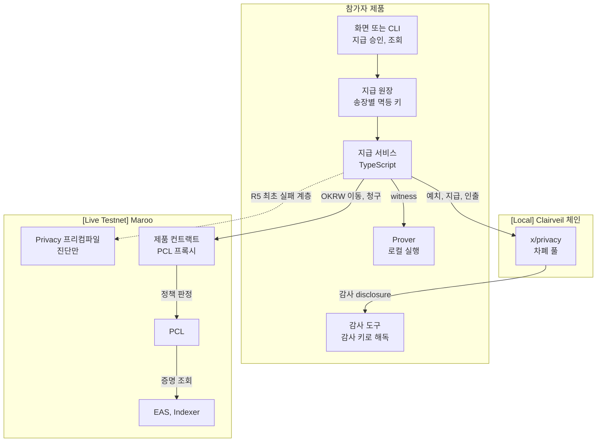

# 트랙 1. 기밀 정산 (Flagship)

- 기준과 표시: [포트폴리오](../portfolio.md) 머리말과 같습니다.
- 이 문서의 1~15절은 모든 트랙이 갖추는 항목이고, 16~26절은 Flagship 트랙에만 있는 항목입니다.

## 1. 트랙 이름

기밀 정산 (Private Settlement)

## 2. 핵심 주제

기업 간 대금의 금액과 거래처를 공개 체인에서 숨기면서, 감사인과 정책 검사는 그대로 통과하는 정산을 만든다.

## 3. 문제 정의

기업이 협력사 대금, 급여, 인센티브를 공개 체인에서 치르면 누가 누구에게 얼마를 줬는지가 모두 드러납니다. 단가와 거래처는 기업이 영업비밀로 관리하는 정보라서, 공개 체인 결제는 지급 업무에 쓰이지 못해 왔습니다. Maroo는 OKRW를 차폐 풀에 넣고 증명으로 옮기는 Privacy 프리컴파일과, 그 호출을 정책으로 판정하는 PCL을 갖고 있습니다. 그런데 외부 개발자가 이 기능으로 끝까지 만든 정산 앱은 아직 없습니다. 테스트넷 Privacy 프리컴파일의 최근 tx는 2026-09-21이 마지막이고, 외부에서 유효한 증명을 만들 재료는 공개되지 않았습니다 `[Live Testnet]`. 이 트랙은 기업 지급 업무의 한 장면을 골라, 숨길 것과 감사인에게 열 것과 정책이 막을 것을 한 제품 안에서 설계하게 합니다.

## 4. 대상 빌더

- 결제, 정산, ERP, 재무 시스템을 만들어 온 핀테크와 기업 백엔드 개발자
- 영지식 증명과 프라이버시 프로토콜에 관심 있는 블록체인 개발자
- 감사, 회계, 규제 보고 도구를 만드는 개발자

TypeScript나 Go로 백엔드를 만들 수 있으면 충분합니다. 회로를 새로 짤 필요는 없습니다.

## 5. 적합한 활용 사례

- 구매 기업이 협력사 여러 곳에 대금을 일괄 지급
- 급여와 상여 지급
- 판매 인센티브, 리워드 지급
- 계열사 사이의 정산과 상계
- 보조금, 후원금 집행(대중에는 비공개, 감사인에게는 공개)

## 6. 필수 Maroo primitive

Privacy / `x/privacy`, PCL, OKRW. EAS는 선택입니다(협력사 자격 확인에 쓰면 가산).

## 7. 각 primitive가 필요한 이유

| primitive | 이 트랙에서 하는 일 | 빼면 생기는 일 |
| --- | --- | --- |
| Privacy | 예치, 지급, 인출로 금액과 받는 쪽을 숨기고, 감사 disclosure로 감사인에게 엽니다 | 공개 전송이 되어 주제가 성립하지 않음 |
| OKRW | 차폐 풀이 보관하는 유일한 자산이고, 예치와 인출에서 투명 잔액과 오갑니다 `[Docs Only]` | 가치 흐름이 없음 |
| PCL | Privacy의 모든 상태 변경 호출을 호출자 기준으로 판정하고, 제품 컨트랙트의 자격 검사를 체인에서 집행합니다 | 규칙을 지키는 정산이라는 주장을 증명할 수 없음 |

## 8. 최소 연동 요건

외부 빌더가 쓸 수 있는 유효한 Maroo Privacy 경로가 행사 시점에 열려 있는지에 따라 R1의 환경이 달라집니다. 운영진은 행사 시작 때 둘 가운데 하나를 공지합니다.

| 요건 | 내용 | 환경 | 판정 방법 |
| --- | --- | --- | --- |
| R1 차폐 흐름 | 한 정산 주기 안에서 예치, 지급(단건 또는 일괄), 받는 쪽의 스캔, 인출을 끝까지 실행 | Maroo 재료가 공개됐으면 `[Live Testnet]`, 아니면 고정한 Clairveil 커밋의 `[Local]` | 테스트넷: tx 해시 네 종류의 영수증. 로컬: 심사위원이 한 명령으로 재현해 같은 결과 |
| R2 disclosure | 보낸 쪽이 아닌 쪽(받는 협력사나 감사인)이 disclosure를 풀어 금액을 확인하는 화면이나 출력이 제품 안에 있음 | R1과 같음 | 해독 결과의 `verified=true`와 금액 |
| R3 정책 판정 | 제품의 Maroo 테스트넷 컨트랙트나 흐름에서 PCL이 한 번은 거부하고 한 번은 통과시킴 | `[Live Testnet]` | 거부: 되돌려진 tx 해시나 `eth_estimateGas`의 사유 코드 기록. 통과: 성공 tx 해시. `IPcl.contractPolicies(대상)`에 정책이 묶여 있음 |
| R4 OKRW 흐름 | 제품의 테스트넷 흐름에서 OKRW가 실제로 이동 | `[Live Testnet]` | value가 0보다 큰 tx 또는 잔액 변화 |
| R5 Privacy 진단 | R1을 로컬로 했다면, 같은 요청 모양을 Maroo Privacy 프리컴파일에 불러 처음 막히는 층과 누락된 재료를 기록 | `[Live Testnet]` eth_call, eth_estimateGas | 기록 파일과 재현 명령 |
| R6 경계 표시 | README와 데모가 `[Local]`과 `[Live Testnet]` 결과를 나눠 적음 | 문서 | 심사위원 확인 |

R3와 R4는 R1과 다른 컨트랙트여도 됩니다. 예를 들어 인출한 대금을 받는 정산 금고에 KYB 정책을 걸면 R3와 R4를 함께 채웁니다.

## 9. 제출자가 연동을 증명하는 방법

- `evidence.json`에 R1~R5마다 한 항목 이상을 적습니다. 항목 형식은 [23절](#23-테스트넷-증거-요건)에 있습니다.
- 로컬 경로는 README 첫 화면에 한 줄 명령(예: `pnpm first-success`)과 예상 출력의 앞부분을 둡니다.
- 거부 경로는 사유 코드를 해석한 문자열까지 남깁니다. `AnyOfRejected`면 안쪽 사유도 풀어 적습니다.

## 10. 필수 제출 자료

- 공통 제출 자료([포트폴리오 4절](../portfolio.md#공통-제출-자료))
- 차폐 흐름에서 역할마다 볼 수 있는 것과 제3자가 공개 체인에서 읽을 수 있는 것을 정리한 표
- 쓴 Clairveil 커밋 SHA와 회로 산출물을 만든 방법

## 11. 심사 기준과 배점

| 기준 | 배점 | 높은 점수를 받는 제출 |
| --- | --- | --- |
| 연동 깊이와 정확성 | 30 | R1~R5를 넘어 일괄 지급, `*WithAuthorization` 대리 제출, 노트 예약과 재시도, 감사 도구를 제대로 씀 |
| 프라이버시와 감사 설계 | 25 | 예치와 인출 금액의 연결, 일괄 지급 건수 같은 누출을 스스로 찾아 줄이는 설계와 근거가 있음 |
| 증거와 재현성 | 20 | 심사위원이 15분 안에 로컬 경로를 재현하고, 테스트넷 증거가 자동 판정을 통과함 |
| 문제와 사용자 가치 | 15 | 실제 지급 업무의 장면(누가 승인하고, 누가 대사하고, 누가 감사하는지)이 구체적임 |
| 완성도와 데모 | 10 | 성공과 거부를 모두 보여 주는 데모 |

## 12. 프로젝트 예시

1. 협력사 대금 일괄 정산 콘솔: 송장을 업로드하면 일괄 지급을 만들고, 협력사는 자기 몫만 확인하고, 감사인은 월말에 모든 지급을 해독해 대사합니다.
2. 급여 지급과 감사 열람 도구: 급여는 차폐 지급으로 나가고, 외부감사인은 감사 disclosure로 총액과 건별 금액을 확인합니다.
3. 보조금 집행 장부: 수혜 기관 목록과 금액은 대중에게 숨기고, 감독 기관만 열람합니다. 수령 기관의 인출은 KYB 증명이 있어야 통과합니다.
4. 프라이버시 누출 점검기: 공개 체인 기록만으로 예치와 인출이 금액이나 시점으로 이어지는지 찾아 경고하는 개발자 도구입니다.

## 13. 시작에 필요한 참고 자료

| 자료 | 쓰는 곳 |
| --- | --- |
| [Maroo Docs 프라이버시 프리컴파일](https://docs.maroo.io/concepts/privacy/privacy-precompile-overview/)과 [정책 인식 프리컴파일](https://docs.maroo.io/concepts/privacy/privacy-policy-aware-precompile/) | 테스트넷 인터페이스와 PCL 판정 순서 |
| [Clairveil v0.4.0](https://github.com/DELIGHT-LABS/clairveil/tree/ca85b02708fdd75259d4d2ee2d671c21198cec69), [clairveil-samples `8321ded`](https://github.com/DELIGHT-LABS/clairveil-samples/tree/8321dedc231372679cfbea4314d080ecaea2e3f5) | 로컬 차폐 흐름, prover, disclosure, 레퍼런스 앱 |
| 이 레포의 [기관 연동 가이드](../../track-a-explain/integration-guide.md)와 [실행 레시피](../../track-a-explain/runnable-recipe.md) | 구조, 가시성, 실패 진단, 실행 명령 |
| `pnpm a:local`, `pnpm a:inspect`, `pnpm a:probe`, `pnpm c:grounding` | 로컬 첫 성공, 테스트넷 정책과 최초 실패 계층 |

## 14. 흔히 발생하는 무효 또는 피상적 연동

- Privacy 정책을 조회하기만 하고 차폐 흐름을 실행하지 않은 제출
- 증명을 목으로 대신하고 차폐 흐름이 동작하는 것처럼 보여 준 제출
- Clairveil 로컬 결과를 Maroo 테스트넷 결과로 적은 제출
- 잘못된 증명으로 Privacy 프리컴파일을 불러 되돌려진 tx를 연동 성공으로 적은 제출
- PCL 정책을 묶었지만 제품 흐름에서 한 번도 판정에 걸리지 않는 선택자에 둔 제출
- 감사 disclosure를 만들기만 하고 누구도 해독하지 않은 제출

## 15. 보안, 프라이버시, 프로덕션 주의 사항

- 원격 prover는 증명 요청에 든 금액, 노트 난수, Merkle 경로를 봅니다. 참가자는 prover를 어디서 돌리는지 README에 적습니다 `[Docs Only]`.
- 예치 금액과 인출 금액은 공개됩니다. 같은 금액을 예치하고 인출하면 두 거래가 이어집니다 `[Local]`.
- 일괄 지급의 메시지 수가 지급 건수를 드러냅니다 `[Local]`.
- 노트 하나의 금액 상한은 약 18.45 OKRW입니다. 시연 금액은 이 안에서 정합니다 `[Docs Only]`.
- Clairveil 레퍼런스 지갑은 노트 키를 평문 파일로 둡니다. 레포에 올리지 않습니다 `[Docs Only]`.
- 테스트넷에서 네이티브 OKRW 이체의 가스 한도를 21,000으로 고정하면 되돌려지고 수수료만 냅니다. 단순 이체도 일반 계정은 약 104,000, 에이전트 지갑은 약 284,000 가스를 씁니다. ClairveilJS의 `evmSendGasLimit` 기본값이 21,000이므로 Maroo 테스트넷 프로필에서는 `eth_estimateGas` 값으로 바꿉니다 `[Live Testnet]` ([기록](../../track-a-explain/evidence/live/probe-send-gas-20260926T052147Z.json)).
- 테스트넷 Privacy 호출에는 개인 본인 인증 증명이 필요합니다. 실제 개인정보를 제출물이나 로그에 남기지 않습니다 `[Live Testnet]`.
- Clairveil은 외부 감사를 받지 않은 실험 단계 구현입니다. 제출물을 프로덕션 준비 상태로 소개하지 않습니다 `[Docs Only]`.

## 16. 레퍼런스 아키텍처



Maroo가 Privacy 재료를 공개한 경우에는 `[Local] Clairveil 체인` 상자로 가던 호출이 `[Live Testnet] Maroo` 상자의 Privacy 프리컴파일로 옮겨 가고, 점선은 실선이 됩니다.

## 17. 개발자 여정

| 단계 | 참가자가 하는 일 | 끝났다고 보는 기준 | 걸리는 시간(목표) |
| --- | --- | --- | --- |
| 1. 첫 성공 | 스타터 키트로 로컬 차폐 정산을 한 번 실행 | 받는 쪽 disclosure 해독과 인출 성공이 출력됨 | 15분 |
| 2. 테스트넷 연결 | 지갑을 만들고 운영진 배분으로 테스트넷 OKRW를 받고, Privacy 정책과 최초 실패 계층을 조회 | R5 기록 파일 | 30분 |
| 3. 정책 설계 | 제품 컨트랙트를 PCL 프록시로 배포하고, 자격이나 한도 정책을 한 선택자에 묶음 | R3의 거부 한 번과 통과 한 번 | 2~3시간 |
| 4. 제품 흐름 | 지급 원장, 일괄 지급, 재시도, 감사 해독을 제품 기능으로 묶음 | R1, R2, R4 | 해커톤 본 시간 |
| 5. 누출 점검 | 제3자가 읽을 수 있는 필드를 정리하고 줄이는 설계를 넣음 | 가시성 표 | 1~2시간 |
| 6. 제출 | `evidence.json`, README, 데모 영상 | 자동 판정 통과 | 1시간 |

## 18. 필수 온체인·오프체인 구성 요소

| 구분 | 구성 요소 | 필수 여부 |
| --- | --- | --- |
| 온체인 | Privacy 프리컴파일(테스트넷) 또는 Clairveil `x/privacy`(로컬) | 필수 |
| 온체인 | PCL 정책이 묶인 제품 컨트랙트(테스트넷) | 필수 |
| 온체인 | EAS 스키마와 증명(테스트넷) | 선택 |
| 오프체인 | 지급 원장과 지급 서비스 | 필수 |
| 오프체인 | prover | 필수(로컬 실행) |
| 오프체인 | 감사 도구 | 필수(R2) |
| 오프체인 | 화면 | 선택. CLI로 대신할 수 있음 |

## 19. 스타터 키트 명세

| 항목 | 내용 |
| --- | --- |
| 고정 버전 | Node 24, pnpm 11, viem 2.56.8, `@maroo-chain/contracts` 0.0.9, `@maroo-chain/viem` 0.4.0, Clairveil v0.4.0 `ca85b027`, ClairveilJS `faf220d5`, clairveil-samples `8321ded`, Foundry 1.8.1 |
| 명령 | 스타터 키트에 둘 이름입니다. 이 레포에서는 괄호 안의 명령이 같은 일을 합니다. `pnpm setup:clairveil`(같은 이름), `pnpm first-success`(`pnpm a:local`, 로컬 차폐 정산 한 번), `pnpm inspect`(`pnpm a:inspect`, `pnpm a:probe`, 테스트넷 Privacy 정책과 최초 실패 계층), `pnpm deploy:vault`(`pnpm a:kyb-gate`, PCL 프록시 금고), `pnpm evidence`(`evidence.json` 생성. 이 레포에는 트랙 2용 `pnpm c:agent-limit`과 트랙 1 예시용 `pnpm c:judge-example`이 있음) |
| 코드 | 지급 서비스 뼈대, 로컬 체인 실행기, disclosure 해독 예시, PCL 프록시 금고와 테스트, 사유 코드 해석기(`AnyOfRejected` 안쪽까지) |
| 문서 | 라벨 규칙, 가시성 표 양식, 자주 막히는 곳 |
| 기준 구현 | 체인 쪽 흐름은 이 레포의 `shared/`와 `track-a-explain/recipe/`입니다(`pnpm a:local`, `pnpm a:inspect`, `pnpm a:probe`, `pnpm a:kyb-gate`). PCL 정책과 프록시 코드는 Maroo 공식 SDK `@maroo-chain/viem`을 씁니다. 지갑과 dApp 쪽은 ClairveilJS `faf220d5`와 clairveil-samples `8321ded`를 기준으로 삼습니다. ClairveilJS는 Maroo `IPrivacy`와 ABI 해시가 같은 EVM Privacy 계약 v0.3.1을 검증하고 conformance 113개를 통과했습니다 `[코드 대조]`. Maroo 테스트넷에서는 차폐 상태 조회 경로가 없어 예치 준비에서 멈춥니다 `[Live Testnet]`. clairveil-samples는 React dApp, 로컬 스택(체인, prover, 웹앱) 실행 스크립트, EVM 설정 예시를 줍니다 `[Docs Only]`. ClairveilJS의 네이티브 이체 가스 한도 기본값(21,000)은 Maroo에서 바꿔야 합니다(15절) |

## 20. 권장 디렉터리 구조

```text
my-private-settlement/
  README.md              # 첫 화면에 한 줄 명령, 라벨별 결과, 한계
  evidence.json          # 요건별 증거(23절 형식)
  contracts/             # PCL 프록시로 배포할 제품 컨트랙트와 테스트
  services/
    ledger/              # 송장, 멱등 키, 상태
    payer/               # 예치, 일괄 지급, 인출 요청
    auditor/             # 감사 disclosure 해독과 대사
  scripts/
    first-success.ts     # [Local] 로컬 차폐 정산
    inspect.ts           # [Live Testnet] 정책과 최초 실패 계층
    deploy-vault.ts      # [Live Testnet] PCL 프록시와 정책
  vendor/                # 고정 커밋의 Clairveil (git 제외)
```

## 21. 15분 첫 성공 경로 `[Local]`

Maroo 테스트넷 Privacy는 외부 빌더가 유효한 증명을 만들 재료가 공개되지 않아, 첫 성공은 Clairveil 로컬 참조 경로로 정합니다.

```bash
git clone https://github.com/kyle-park-io/maroo-integration-lab.git
cd maroo-integration-lab
pnpm install
pnpm setup:clairveil
pnpm a:local
```

- 준비물: Node 24 이상, pnpm, Go 1.25 이상, Git, 약 600MB 여유 공간, 비어 있는 127.0.0.1:26657
- 성공 기준: 출력의 실행 기록에 협력사 B의 disclosure 해독(`verified=true`, 금액 15)과 인출 성공이 나옵니다.
- 이 머신에서 `pnpm a:local`은 빌드와 회로 산출물 생성을 포함해 약 4분 걸렸습니다 `[Local]`.
- 같은 시간 안에 테스트넷 쪽 첫 확인으로 `pnpm setup:wallets`와 `pnpm a:inspect`를 실행할 수 있습니다. 키와 잔액 없이 정책 조회까지 됩니다 `[Live Testnet]`.

## 22. 연동 승인 체크리스트

심사위원이 제출물마다 채웁니다.

- [ ] R1 차폐 흐름: 예치, 지급, 스캔, 인출이 모두 있고 환경 라벨이 맞음
- [ ] R1 재현: README 명령으로 15분 안에 같은 결과가 나옴(로컬인 경우)
- [ ] R2 disclosure: 보낸 쪽이 아닌 쪽의 해독 결과가 `verified=true`
- [ ] R3 거부: PCL 사유 코드가 해석되어 있고 대상 컨트랙트에 정책이 묶여 있음
- [ ] R3 통과: 같은 대상의 성공 tx
- [ ] R4 OKRW: 테스트넷 흐름에서 OKRW 이동
- [ ] R5 진단: Privacy 프리컴파일의 최초 실패 계층과 누락 재료 기록(로컬인 경우)
- [ ] R6 경계: 로컬과 테스트넷 결과를 합쳐 적지 않음
- [ ] 키, 시드, 실제 개인정보가 레포와 로그에 없음

## 23. 테스트넷 증거 요건

`evidence.json`은 요건마다 아래 필드를 둡니다.

```json
{
  "requirement": "R3",
  "label": "[Live Testnet]",
  "network": "maroo-testnet",
  "chainId": 450815,
  "target": "0x… (제품 컨트랙트 프록시)",
  "call": "claim()",
  "input": "호출자: 증명 없는 협력사",
  "txHash": "0x…",
  "explorer": "https://explorer-testnet.maroo.io/tx/0x…",
  "expected": "PCL 거부",
  "actual": "EasNoAttestationReceived(0x…)",
  "executedAt": "2026-10-01T03:12:00Z"
}
```

- 거부를 tx로 남기지 못하면 `txHash` 대신 `eth_estimateGas` 요청과 응답 원문을 `rpcLog`에 넣습니다.
- 자동 판정은 `pnpm c:judge <evidence.json> --track 1`([판정 스크립트](../judge/check-evidence.ts))이 합니다. tx 해시로 영수증 상태, 받는 주소, value를 확인하고, 거부 항목은 직전 블록 상태로 같은 호출을 다시 시뮬레이션해 `actual`의 사유와 맞는지 봅니다. `target`에 대해 `IPcl.contractPolicies`를 불러 정책이 묶였는지, 정책의 선택자가 호출한 함수와 같은지도 봅니다.
- 로컬 항목은 `txHash` 자리에 로컬 체인 tx 해시를 넣고 라벨을 `[Local]`로 둡니다. 자동 판정은 로컬 항목을 건너뛰고 재현 확인에서 봅니다.

## 24. 심사 과정 예시

가상의 제출 "정산메이트"를 예로 듭니다. 1단계의 자동 판정은 이 레포의 Track A 기록으로 실제로 돌려 볼 수 있습니다(`pnpm c:judge-example`, [결과](../evidence.md#5-심사-자동-판정-예시-live-testnet-조회)).

1. 자동 판정: R3 거부 tx의 영수증이 `status=reverted`이고 `contractPolicies(target)`에 `EAS_POLICY`가 `claim()` 선택자로 묶여 있어 통과. R4의 tx는 value 50 OKRW라 통과. R1과 R2는 `[Local]` 라벨이라 재현 확인으로 넘어감.
2. 재현 확인: 심사위원 노트북에서 `pnpm first-success`가 9분 만에 끝나고, 해독 결과가 제출물의 표와 같음.
3. 리뷰: 예치를 송장별로 해서 예치와 인출 금액이 이어지는 누출을 README가 인정하고, 주기별 총액 예치로 바꾸는 설계를 제시해 프라이버시 설계 점수를 받음. 감사 도구가 일괄 지급의 첫 메시지만 해독해 연동 정확성에서 감점.
4. 결과: 자동 판정과 재현을 통과했고 리뷰 점수 순위로 결선에 오름.

## 25. 워크샵과 오피스아워

| 회차 | 시간 | 내용 |
| --- | --- | --- |
| 킥오프 | 30분 | 트랙 주제, 최소 연동 요건, 라벨 규칙, 첫 성공 경로 시연. 세 트랙 소개에는 [요약 장표 12](../../slides/slide-12.png), 테스트넷과 로컬의 경계에는 [요약 장표 7](../../slides/slide-07.png)을 씁니다 |
| 오피스아워 1 | 60분 | 로컬 차폐 흐름: 노트, 일괄 지급, 스캔, disclosure 해독, 인출 실패와 우회 |
| 오피스아워 2 | 60분 | 테스트넷 연결: PCL 프록시 배포, 정책 바인딩, 증명 발급과 색인, 거부 사유 해석, `eth_estimateGas` 사전 검사 |
| 제출 전 점검 | 30분 | `pnpm c:judge`로 `evidence.json` 자동 판정을 미리 돌려 보고 빠진 요건 확인 |

## 26. 멘토가 자주 받을 질문과 답변 방향

| 질문 | 답변 방향 |
| --- | --- |
| 테스트넷 Privacy를 부르면 `SDKInvalidRequest`가 나옵니다 | 외부에서 유효한 증명을 만들 재료가 없어 요청 검증에서 막힙니다. R1은 로컬로 하고, 이 오류를 R5 기록으로 남기게 안내합니다 |
| `EasNoAttestationReceived`로 거부됩니다 | 호출자에게 정책이 요구하는 증명이 없거나 색인되지 않았습니다. 발급 뒤 `indexAttestation`까지 했는지 확인하게 합니다 |
| `eth_call`로는 통과했는데 tx가 거부됩니다 | 전역 정책은 `eth_call`에서 평가되지 않습니다. `eth_estimateGas`로 사전 검사하게 합니다 |
| faucet이 실패합니다 | faucet 계정이 전역 24시간 한도에 걸렸을 수 있습니다. 운영진 배분 지갑을 안내합니다 |
| 로컬 인출이 `merkle root snapshot re-registration is inconsistent`로 실패합니다 | Clairveil v0.4.0에서 잎이 늘지 않은 블록의 인출이 실패합니다. 같은 블록에 0 노트 예치를 함께 넣게 안내합니다 |
| 큰 금액을 차폐하려는데 거부됩니다 | 노트 하나의 상한이 약 18.45 OKRW입니다. 시연 금액을 줄이거나 여러 노트로 나누게 합니다 |
| 감사인이 일괄 지급의 일부만 해독합니다 | CLI의 tx 해시 해독은 첫 메시지만 풉니다. 메시지마다 감사 암호문을 꺼내 해독하게 합니다 |
| `deployPclProxy`가 이유 없이 되돌려집니다 | 초기화 데이터가 비어 있으면 되돌려집니다. 초기화 함수 호출을 넣게 합니다 |
| 로컬 결과를 테스트넷 성공으로 써도 되나요 | 쓰지 않습니다. 라벨을 나누고, 테스트넷에서 막힌 층을 R5로 적는 것이 요건입니다 |
