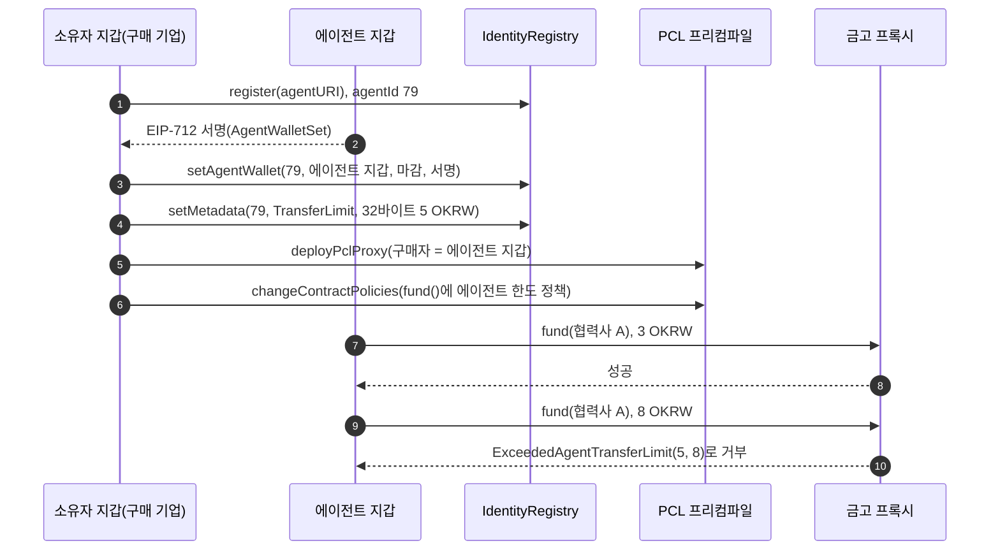

# 트랙 2. 규칙 안의 에이전트 결제

- 기준과 표시: [포트폴리오](../portfolio.md) 머리말과 같습니다.

## 1. 트랙 이름

규칙 안의 에이전트 결제 (Agent Payments within Rules). 기기가 결제하는 갈래의 모집 이름은 "움직이는 에이전트의 지갑"입니다.

## 2. 핵심 주제

AI 에이전트와 기기가 등록된 신원과 소유자가 정한 한도 안에서만 원화를 쓰게 한다.

## 3. 문제 정의

에이전트에게 결제를 맡기려면 두 가지가 먼저 풀려야 합니다. 결제한 주체가 어떤 에이전트이고 누가 소유했는지 확인할 수 있어야 하고, 프롬프트 조작이나 오작동이 있어도 정해진 한도를 넘지 못해야 합니다. 앱 코드 안의 한도는 컨트랙트를 직접 부르는 호출을 막지 못합니다. Maroo는 ERC-8004 IdentityRegistry로 에이전트 신원을 기록하고, PCL의 에이전트 한도 템플릿으로 에이전트 지갑의 전송을 체인에서 거부합니다 `[Docs Only]`. 테스트넷 IdentityRegistry의 다음 agentId가 79라 에이전트 78개 안팎이 등록된 것으로 보이지만, 레지스트리로 간 마지막 tx는 2026-09-06입니다 `[Live Testnet]`. 이 트랙은 신원과 한도를 실제로 쓰는 에이전트 결제 제품을 만들게 합니다.

## 4. 대상 빌더

- LLM 도구 호출, MCP, 에이전트 프레임워크로 제품을 만드는 AI 에이전트 개발자
- 로봇, 드론, 충전기, IoT 기기를 다루는 피지컬 AI 개발자(기기 갈래)
- 결제와 구독 서비스를 만드는 백엔드 개발자

## 5. 적합한 활용 사례

- API 호출이나 데이터 구매마다 원화로 치르는 에이전트
- 소모품 재주문, 예약, 구독을 대신하는 구매 대행 에이전트
- 충전, 주차, 통행 요금을 스스로 치르는 기기(기기 갈래)
- 에이전트끼리 서비스를 사고파는 시장

## 6. 필수 Maroo primitive

Agent identity(ERC-8004 IdentityRegistry와 Agent 프리컴파일) 또는 MAWS, OKRW, PCL. EAS는 선택입니다(소유자 KYC 증명을 쓰면 가산).

## 7. 각 primitive가 필요한 이유

| primitive | 이 트랙에서 하는 일 | 근거 |
| --- | --- | --- |
| Agent identity | 에이전트 ID, 소유자, 에이전트 지갑, 한도 메타데이터(`TransferLimit`)를 체인에 둡니다. Agent 프리컴파일의 `getAgentIds(지갑)`로 지갑에서 에이전트를 찾습니다. 찾는 기준은 소유자가 아니라 연결된 에이전트 지갑입니다 | `[Live Testnet]` 등록, 지갑 연결, 조회 |
| OKRW | 에이전트가 치르는 대금 | `[Docs Only]` |
| PCL | `AGENT_OKRW_TRANSFER_LIMIT_POLICY`가 `TransferLimit`을 넘는 OKRW 전송을 `ExceededAgentTransferLimit`로 거부합니다. 전역 정책은 에이전트 소유자 기준으로 24시간 한도와 KYC를 평가합니다 | `[Live Testnet]` 한도 안 결제 성공과 초과 거부 tx(16절), 전역 정책 조회 |
| MAWS | 에이전트 지갑 발급, 키 보관, 체인 밖 사전 검사를 대신할 수 있습니다. 쓰면 R1의 등록을 대신합니다 | `[Docs Only]` |

## 8. 최소 연동 요건

| 요건 | 내용 | 환경 | 판정 방법 |
| --- | --- | --- | --- |
| R1 신원 | IdentityRegistry에 에이전트를 등록하고 에이전트 지갑을 연결(또는 MAWS로 에이전트 생성) | `[Live Testnet]` | `register` tx와 `setAgentWallet` tx. 연결 전에는 `getAgentIds(소유자)`, 연결 뒤에는 `getAgentIds(에이전트 지갑)`이 그 ID를 돌려줌. 연결 뒤 소유자 주소로는 빈 목록이 나오고 `ownerOf`는 소유자 그대로(16절) |
| R2 한도 | `getMetadata(agentId, "TransferLimit")`에 한도를 쓰고, 제품 컨트랙트에 `AGENT_OKRW_TRANSFER_LIMIT_POLICY`를 묶음 | `[Live Testnet]` | `setMetadata` tx(값이 32바이트 uint256인지 판정 스크립트가 확인), `IPcl.contractPolicies(제품 컨트랙트)` |
| R3 결제 | 에이전트 지갑이 한도 안의 OKRW 결제를 성공 | `[Live Testnet]` | 성공 tx, value나 잔액 변화 |
| R4 거부 | 한도를 넘는 결제가 거부됨 | `[Live Testnet]` | 되돌려진 tx나 `eth_estimateGas` 기록의 `ExceededAgentTransferLimit(maxLimit, value)` |
| R5 에이전트 동작 | 거부를 받은 에이전트가 사유를 해석해 행동을 바꿈(사람에게 승인 요청, 작업 중단 등). 한도를 피하려고 금액을 쪼개 다시 보내지 않음 | 제품 | 데모와 에이전트 로그 |
| R6 기기 갈래 | 결제를 기기나 기기 시뮬레이터의 이벤트가 시작 | 제품 | 데모. 하드웨어는 선택 |

## 9. 제출자가 연동을 증명하는 방법

- `evidence.json`(형식은 [트랙 1의 23절](1-private-settlement.md#23-테스트넷-증거-요건))에 R1~R4의 tx 해시를 적습니다.
- R5는 에이전트가 받은 오류 원문, 해석한 사유, 다음 행동을 한 줄씩 남긴 로그를 제출합니다.
- 기기 갈래는 기기 이벤트와 결제 tx를 잇는 로그를 둡니다.

## 10. 필수 제출 자료

- 공통 제출 자료([포트폴리오 4절](../portfolio.md#공통-제출-자료))
- 에이전트 ID, 소유자, 에이전트 지갑, `TransferLimit` 값을 적은 표
- 에이전트의 결제 결정 흐름(무엇을 보고 결제하고, 거부되면 무엇을 하는지)

## 11. 심사 기준과 배점

| 기준 | 배점 | 높은 점수를 받는 제출 |
| --- | --- | --- |
| 연동 깊이와 정확성 | 30 | 신원, 한도, 결제가 한 흐름으로 이어지고 전역 정책(소유자 기준 평가)까지 설명함 |
| 거부 이후의 에이전트 동작과 안전 설계 | 25 | 거부 사유별로 동작이 다르고, 프롬프트 조작 시나리오에서도 체인 한도가 마지막으로 막는 것을 보여 줌 |
| 증거와 재현성 | 20 | 자동 판정 통과, README 명령으로 재현 |
| 문제와 사용자 가치 | 15 | 사람이 에이전트에게 결제를 맡길 이유가 구체적임 |
| 완성도와 데모 | 10 | 성공 결제와 거부를 모두 보여 줌 |

## 12. 프로젝트 예시

1. 유료 API 결제 에이전트: 도구 호출마다 원화로 치르고, 한도를 넘는 호출은 사람에게 승인을 묻습니다.
2. 사무용품 재주문 에이전트: 재고가 줄면 주문하고, 건당 한도 안에서만 결제합니다.
3. 전기차 충전 결제(기기 갈래): 충전기가 에이전트 신원으로 요금을 청구하고, 차량 에이전트가 한도 안에서 치릅니다.
4. 배달 로봇 통행료(기기 갈래): 건물 출입과 엘리베이터 사용료를 로봇이 치르고, 관리 회사는 등록된 로봇만 받습니다.
5. 데이터 구매 시장: 에이전트가 다른 에이전트의 데이터를 사고, 판매 쪽은 등록된 에이전트인지 확인합니다.

## 13. 시작에 필요한 참고 자료

| 자료 | 쓰는 곳 |
| --- | --- |
| [ERC-8004 IdentityRegistry](https://docs.maroo.io/concepts/agents/erc-8004-identity-registry/), [Agent 프리컴파일](https://docs.maroo.io/concepts/agents/agent-precompile-overview/) | 신원 구조와 조회 |
| [AGENT_OKRW_TRANSFER_LIMIT_POLICY](https://docs.maroo.io/concepts/compliance/pcl-template-agent-okrw-transfer-limit-policy/) | 한도 메타데이터와 거부 사유 |
| [두 층 정책 모델](https://docs.maroo.io/concepts/agents/two-layer-policy-model/), [MAWS 구조](https://docs.maroo.io/concepts/agents/maws-architecture-overview/) | MAWS를 쓸 때 |
| [탐색기에 검증된 IdentityRegistry 소스](https://explorer-testnet.maroo.io/address/0x8004000000000000000000000000000000000001?tab=contract) | 실제 함수 목록. 문서의 호출 스케치와 다르므로 이 소스를 기준으로 삼음 |
| `pnpm c:grounding` | 레지스트리, 프리컴파일, 템플릿, 전역 정책 조회와 등록 시뮬레이션. `--write`로 등록 tx 한 건 |
| `pnpm c:agent-limit` | R1~R4를 테스트넷에서 한 번에 채우는 흐름(16절). Maroo 공식 SDK `@maroo-chain/viem`의 레지스트리 액션, `policy.agentOkrwTransferLimit`, `pcl.deployPclProxy`, `simulatePclProxy`를 씀 |

## 14. 흔히 발생하는 무효 또는 피상적 연동

- 에이전트를 등록만 하고 결제나 한도에 쓰지 않은 제출
- 에이전트와 연결되지 않은 일반 지갑으로 결제한 제출
- 한도를 앱 코드나 LLM 프롬프트로만 지키고 체인 정책이 없는 제출
- `TransferLimit` 메타데이터를 썼지만 정책을 묶지 않아 거부 증거가 없는 제출
- 거부를 받은 에이전트가 금액을 쪼개 다시 보내 한도를 피한 제출
- 기기 갈래에서 기기와 결제의 연결이 영상 연출뿐인 제출

## 15. 보안, 프라이버시, 프로덕션 주의 사항

- 에이전트 지갑 키가 새면 한도까지는 결제가 일어납니다. 키는 MAWS나 기기의 보안 저장소에 두고 레포에 올리지 않습니다.
- 체인 한도는 건당 한도입니다 `[Docs Only]`. 누적 한도가 필요하면 전역 정책의 24시간 한도나 제품 컨트랙트의 기간 한도 정책을 함께 씁니다.
- `TransferLimit` 값은 aokrw 금액을 32바이트 big-endian uint256으로 씁니다(viem: `numberToHex(한도, { size: 32 })`). Maroo Docs가 적은 숫자 문자열이나 빈 값이면 `AgentTransferLimitMetadataInvalid(expected 32-byte uint256, got 19 bytes)` 같은 해석 가능한 오류로 한도 안 결제까지 모두 거부됩니다 `[Live Testnet]` (16절).
- `setAgentWallet`은 새 에이전트 지갑이 EIP-712(`AgentWalletSet(agentId, newWallet, owner, deadline)`)로 서명하고 소유자가 보냅니다 `[Live Testnet]`. 마감은 체인 블록 시각 기준 5분 안이어야 합니다. 블록 시각 +299초로 서명한 요청은 시뮬레이션을 통과했고 +301초는 `deadline too far`로 되돌려졌습니다 `[Live Testnet]` 시뮬레이션([기록](../evidence/live/agent-limit-20260926T053121Z.json) 1단계).
- 전역 정책은 에이전트가 보낼 때 소유자 모두가 24시간 1,000만 OKRW 안이거나 KYC 증명을 갖기를 요구합니다 `[Live Testnet]`. 시연 금액과 소유자 지갑을 이에 맞춰 준비합니다.
- Maroo Docs의 IdentityRegistry 호출 스케치(`bytes32 agentId`, `attest`, `revoke`)는 테스트넷에 배포된 컨트랙트(`uint256 agentId`, `register`, `setMetadata`, `setAgentWallet`)와 다릅니다 `[Live Testnet]`.
- 에이전트 메타데이터는 공개됩니다. 소유자의 개인정보를 넣지 않습니다.

## 16. 요건을 직접 채운 예시 `[Live Testnet]`

이 레포가 구매 기업 지갑과 에이전트 지갑으로 R1~R4를 테스트넷에서 채웠습니다. 에이전트는 기존 정산 금고(`SettlementVault`)의 구매자 자리에 앉아 협력사 몫을 넣고, 금고의 `fund()`에 에이전트 한도 정책을 묶었습니다. 새 컨트랙트는 만들지 않았습니다.

2026-09-26 04:40 UTC 실행 [기록](../evidence/live/agent-limit-20260926T044056Z.json), 재현: `pnpm setup:wallets`(AGENT 역할을 더함), `pnpm build:contracts`, `pnpm c:agent-limit`

| 요건 | 결과 | tx |
| --- | --- | --- |
| R1 등록 | agentId 79, 소유자 구매 기업 | [0x2c5a…bfad](https://explorer-testnet.maroo.io/tx/0x2c5a0170a44f6f09016ac70e584fb1f1998f7b1efd580afea0673a30624cbfad) |
| R1 지갑 연결 | `getAgentWallet(79)` = 에이전트 지갑. `getAgentIds(에이전트 지갑)` = `[79]`, `getAgentIds(소유자)` = `[]` | [0x7eb9…71bd](https://explorer-testnet.maroo.io/tx/0x7eb9967c2fcf3bd0211bc50b69a88892753eee80ee15cd593eec95e6478571bd) |
| R2 한도 | `TransferLimit` 5 OKRW(32바이트 uint256) | [0x2ea9…73e3](https://explorer-testnet.maroo.io/tx/0x2ea920e9d892552a2e677dd120d6b0d0a2425d5f72b6dc17b1d52f1bb09573e3) |
| R2 정책 | 금고 `0x5855C53f6b6359BDEB0306d9362488c54E6db7c1`의 `fund()`(`0x23024408`)에 `AGENT_OKRW_TRANSFER_LIMIT_POLICY` | [0xac02…5f44](https://explorer-testnet.maroo.io/tx/0xac021a9f55e633f5eeaf3548871eee1faa14ec3b3f02fed6f2781de0be1f5f44) |
| R3 결제 | 에이전트 지갑이 3 OKRW를 넣어 협력사 A 몫 3 OKRW | [0xfbfe…0787](https://explorer-testnet.maroo.io/tx/0xfbfe489ff4545f5d701310ab3f3153cefc15efc22d91813fc69ab89042650787) |
| R4 거부 | 8 OKRW가 `ExceededAgentTransferLimit(5000000000000000000, 8000000000000000000)`로 되돌려짐. 가스 한도 728,023 가운데 364,011 사용 | [0x006c…56b9](https://explorer-testnet.maroo.io/tx/0x006c9bae7cb92d04b2b9ba8f835ef81914ff81b91a5af2c51971b58a3c8856b9) |

`TransferLimit`에 세 가지 값을 차례로 쓰고, 에이전트 지갑의 `fund()`를 보내지 않고 확인한 결과입니다.

| `TransferLimit` 값 | 3 OKRW(한도 안) | 8 OKRW(한도 초과) |
| --- | --- | --- |
| 빈 값 | `AgentTransferLimitMetadataInvalid(empty metadata value)` | 같음 |
| Maroo Docs 형식: 숫자 문자열 `"5000000000000000000"`(19바이트) | `AgentTransferLimitMetadataInvalid(expected 32-byte uint256, got 19 bytes)` | 같음 |
| SDK 주석 형식: 32바이트 big-endian uint256 | 통과(추정 가스 502,449) | `ExceededAgentTransferLimit(5000000000000000000, 8000000000000000000)` |

- 세 경우 모두 `eth_call`(SDK `simulatePclProxy`)과 `eth_estimateGas`가 같은 결과를 냈습니다. 컨트랙트 범위의 에이전트 한도는 `eth_call`로도 미리 확인할 수 있습니다.
- 판정: `pnpm c:judge track-c-activate/evidence/track2-example/evidence.json --track 2`에서 R1~R4 모두 통과했습니다([판정 결과](../evidence/track2-example/evidence.judge.json)). 문서 형식으로 쓴 `setMetadata` tx를 넣으면 R2가 실패로 판정됩니다.
- 새 지갑 파일로 에이전트 등록(agentId 80)부터 다시 실행해도 같은 결과였습니다([등록 기록](../evidence/live/grounding-20260926T053055Z.json), [실증 기록](../evidence/live/agent-limit-20260926T053121Z.json)).
- 한 번 실행에 약 30 OKRW가 듭니다. 구매 기업 19.30(금고 배포, 정책, 메타데이터 세 번), 에이전트 지갑 10.80(결제 3과 가스)이었습니다.
- 확인하지 않은 것: 전역 범위 정책에서 다른 컨트랙트가 에이전트가 시작한 호출을 옮길 때의 귀속, R5와 기기 갈래.
